## P101

字段集

```css
<fieldset>
	<legend>性别</legend>
	<input>111
	<input>111
	<input>111
	<input>111
	<input>111
</fieldset>
```

可以自己看效果，就是加了个边框，边框左上会有个缺口，缺口里面写着“性别”

fieldset在css里面可以更改各种样式


## P102

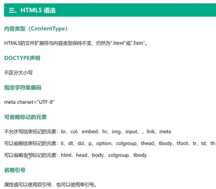


## P103

语义化标签

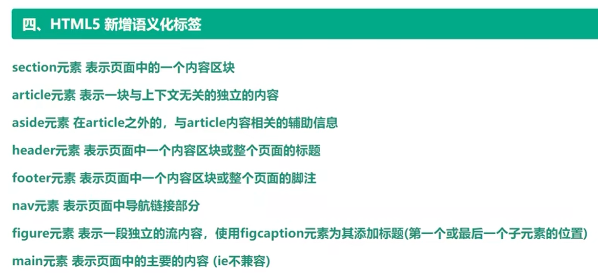

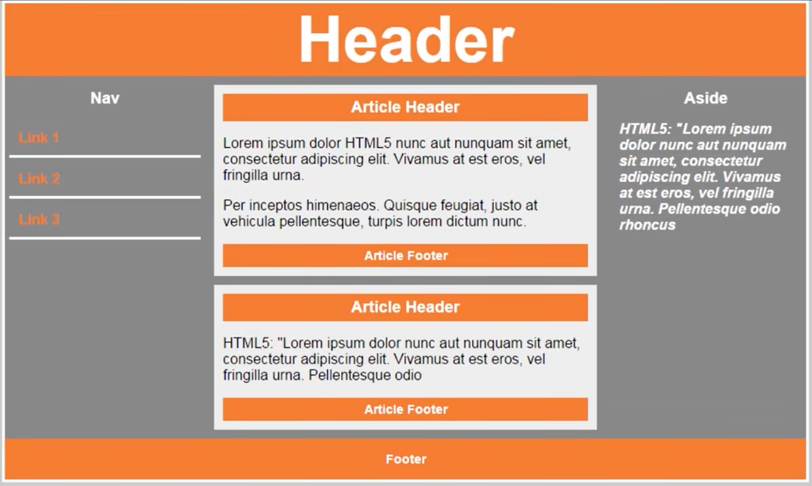

```html
<header></header>
<section>
    <nav></nav>
    <main>
    	<article>
        	<header></header>
            <footer></footer>
        </article>
    </main>
    <aside></aside>
</section>
<footer></footer>
```


## P104

```html
<audio src="" controls loop autoplay muted>音频或视频</audio>
// controls：出现控制栏（注意这个不能缺否则无法显示）
// loop：自动循环
// autoplay：自动播放（有的浏览器会默认关闭写了也没用，需要用js改）
// muted：静音
```


## P105

```html
<video src="" controls loop autoplay muted poster="" width="" height=""></video>
// controls：出现控制栏（注意这个不能缺否则无法显示）
// loop：自动循环
// autoplay：自动播放（有的浏览器会默认关闭写了也没用，需要用js改）
// muted：静音
// poster：封面图片地址
```


## P106

表单增强

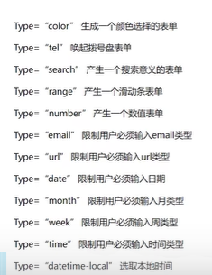

部分属性如`type="tel"`是手机上用的


## P107

选项列表

```html
<input type="text" list="mylist">
<datalist id="mylist">
    <option value="111"></option>
    <option value="222"></option>
    <option value="333"></option>
    <option value="444"></option>
    <option value="555"></option>
</datalist>
```

> 支持模糊搜索

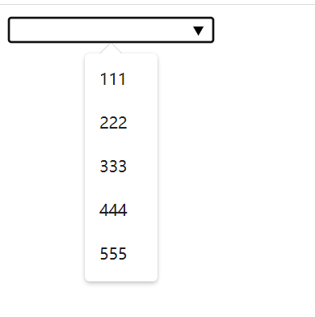

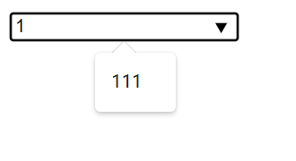


## P108

一些表单里面h5新增的属性

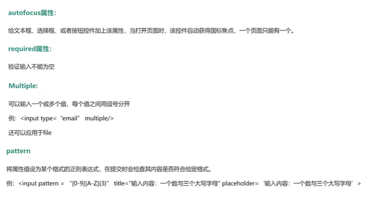


## P109

> css3是完全兼容css2的

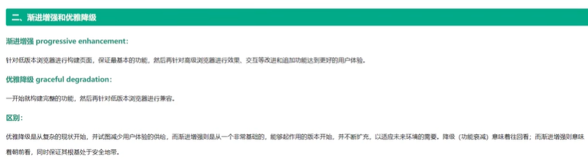


## P110

css3新增 层级选择器

```css
div p {
    div里面的所有p
}
div>p{
    div的儿子节点中的p
}
div+p{
    div下面的所有兄弟节点中第一个p
}
div~p{
    div下面的所有兄弟节点中所有的p
}
```


## P111

css3新增 属性选择器

```css
[class] {
    选择所有有class属性的标签
}
div[class] {
    选择有class属性的div
}
div [class] {
    选择div里面有class属性的标签
}
div[name=username] {
    选择name属性为username的div
}
-----------------------------------
注意：等号代表完全匹配，比如
div[class=box1] {
    
}
无法选中
<div class="box1 box2"></div>
------------------------------------
下面这几个并不常用

div[class~=box1] {
    选择class属性中包含box1的div
}

模糊匹配

div[class^=a] {
    选择class属性以a开头的div
}
div[class$=a] {
    选择class属性以a结尾的div
}
div[class*=a] {
    选择class属性中包含字符a的div
}
```


## P112

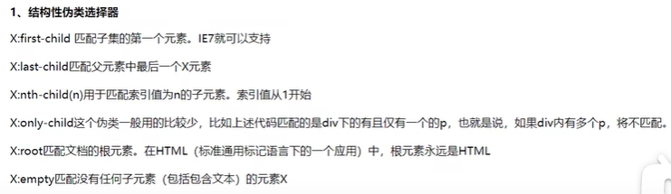

```html
<style>
    .box div:last-child{
        选择第三个div
    }
    .box div:nth-child(2){
        选第二个div
    }
    .box div:nth-child(2n){
        选第偶数个div，显然2n+1就是奇数个
        偶数也可以把2n换成even，2n+1换成odd
    }
</style>

<div class="box">
    <div></div>
    <div></div>
    <div></div>
</div>
```

显然，:后面修饰的是前面的X


## P113

目标伪类选择器

E:target 选择匹配E的所有元素，且匹配元素被相关URL指向

如锚点，点击时会移动到页面相应位置，此时就可以这样来选择当前被移动到的地方的标签

要是以后不明白了建议去看视频或者百度（


这个还能用来实现手风琴效果，见p113.html


## P114

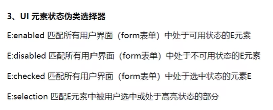

E:focus匹配焦点所在的标签

E:checked是用在选择框如checkbox上的，如果想修改它的样式，有时需要注意先清除它的默认样式，如

```css
input[type=checkbox]{
    // 清除它的默认样式
    appearance: none;
    // 下面自己给它加点样式否则完全没有样式就不显示了
    width:20px;
    height:..;
    border:..;
    ...
}
input:checked{
    选择框被选中时的样式
}
```


```css
div:selection{
    background: yellow;
    color: red;
}
div中被选中的文本会适用如上样式而不是默认的蓝底白字样式
```


## P115

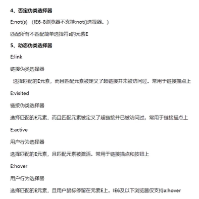


## P116

css3对文本新加的属性：文本阴影

`text-shadow: 10px 10px 10px red`

1. 第一个10px：水平方向位移

2. 第二个10px：垂直方向位移
3. 第三个10px：模糊程度
4. 第四个：阴影颜色

`text-shadow: 1px 1px 1px red, 1px -1px 1px yellow`

阴影可以设置多个，但必须如上设置，不能写多个`text-shadow`


## P117

盒子阴影

`box-shadow: 水平位移 垂直位移 （模糊距离 阴影大小 阴影颜色 inset） `

加上inset就是内阴影

同上，也可以同时设置多个阴影


## P118

盒子圆角

`border-radius: 10px`：四角上10px的正方形变圆

这里的10px也可以用百分比

1. 10px：四角10px圆
2. 1px 2px：左上右下1px圆，左下右上2px圆
3. 1px 2px 3px：左上，左下右上，右下
4. 1px 2px 3px 4px：左上，右上，右下，左下

只实现一个方向的圆角：可以其它方向都设置为0，也可以分开来写如

`border-top-left-radius: 10px`


## P119

`border-radius: 30px/50px`

水平方向走30px，垂直方向走50px，这两个点连一条曲线

注：这种写法只支持总的`border-radius`，不支持分开来写的

`border-radiius: 1px 2px 3px 4px/5px 6px 7px 8px`

四个角的水平方向分别是1234，垂直方向分别是5678


`border-radius: 50%`，当然自己算px也行，在正方形里面这就是个圆

```css
div{
    width:100px;
    height:50px;
    border-radius:50px 50px 0 0;
}
// 这就是半圆
```


## P120

立体搜索框案例

见p120.html


## P121

字体引入，引入本地字体

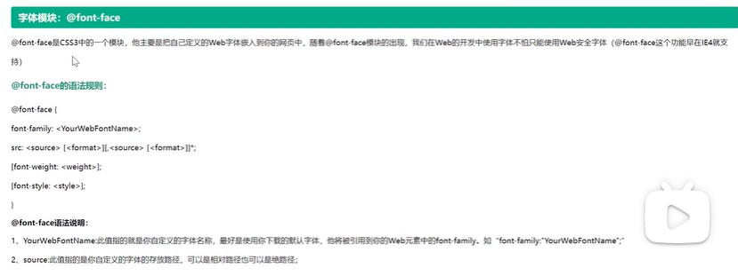


## P122

怪异盒模型

普通盒子由内到外：width和height，padding，border，margin

怪异盒子由内到外：content，padding，border，width和height，margin

区别就是怪异盒子的width和height是包含边框和内边距的，而普通盒子是在width和height外层裹padding和border


设置为怪异盒的方法：`box-sizing: border-box`

> 很多情况下明明是怪异盒更方便来着...或许这个才应该是正常盒子X


## P123

弹性盒：适合用在移动端布局上

设置一个盒子为弹性盒的方法：`display: flex`


默认情况下

1. 弹性盒会让里面的子元素横向排列（默认主轴是水平方向排列，侧轴是垂直方向排列）
2. 弹性盒会让子元素中的行内元素自动变成块元素
3. 弹性盒如果只有一个子盒子，该子盒子设置`margin: auto`可以做到**水平垂直居中**


## P124

弹性盒子的主轴也可以设置为垂直方向排列，此时侧轴则是水平方向排列

设置方法为：`flex-direction: column`

`flex-direction`有四个值

1. `row`：默认，主轴水平方向排列
2. `column`：主轴垂直方向排列
3. `row-reverse`：主轴水平方向排列，但是是从右往左排
4. `column-reverse`：主轴垂直方向排列，但是是从下往上排


## P125

调整主轴对齐方向

`justify-content`：

1. `flex-start`：默认，靠左对齐
2. `flex-end`：靠右对齐
3. `center`：居中对齐
4. `space-between`：两端对齐，中间间隔相同，以主轴水平方向为例，就是左盒子贴着左边，右盒子贴着右边，中间各盒子之间间隔相同
5. `space-around`：距离环绕，以主轴水平方向为例，则是所有子盒子的左右外边距相同，保证最左边盒子的左外边距靠左，最右边盒子的右外边距靠右


调整侧轴对齐方式

`align-item`

可取值和上面的前三个完全相同，不支持后两个


## P126

默认情况下，弹性盒子中的子盒子会沿主轴排列且**不会换行**——这就使得当子盒子变多时，每个盒子则会被压缩挤在主轴上，此时设置的宽高可能失效

当然我们可以设置折行（自动换行）

`flex-wrap: wrap`

设置后行与行之间是**等间距排列**的

控制折行后的行间距的属性如下

`align-content`：（以主轴水平为例）

1. `flex-start`：紧靠左上
2. `flex-end`：紧靠左下
3. `center`：紧靠着居中
4. `space-between`：两端对齐，上下行贴着上下边，中间各行等间距
5. `space-around`：距离环绕，每行的上下边距相同


## P127

弹性盒子：我们称之为 容器

弹性盒子里面的盒子：我们称之为 项目

之前我们都是设置在容器上的属性，下面几章则讨论设置在项目上的属性


`align-self`：（以主轴水平为例）

1. `flex-start`：项目出现在容器最上面
2. `flex-end`：项目出现在容器最下面
3. `center`：项目在容器中垂直居中
4. `baseline`：项目出现在容器最上面
5. `stretch`：**默认，拉伸，如果该项目没有设置高度，则高度会自动设置为容器高度**


## P128

调整项目顺序

`order:0`

默认order都是0，order设置越大，项目越往后排


## P129

`flex:1`：该项目占据剩余主轴空间总份数中的1份

举例：弹性盒子中三个项目，项目1和3都设置了宽度，项目2设置`flex:1`，那么项目2会把中间的宽度占满，然后项目1在最左边，项目3在最右边，这就达成了三栏式中间自适应布局

如果项目1和3设置`flex:1`，项目2设置`flex:2`，那么很显然项目2会占据一半宽度，项目1和3各1/4宽度


## P130

案例来喽！


https://www.iconfont.cn/

阿里的矢量图标库——可以解决遇到图标只能一个个抠图的问题，并且字体图标还不会由于放大而失真

如果以后忘了怎么用，可以回来看这期视频（


## P131

弹性盒子可以很方便地解决许多布局问题

栗子：

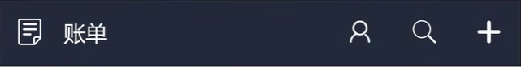

四个小图标设置宽度，“账单”设置`flex:1`


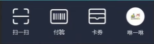

设置四个盒子，每个盒子装的是中间的图标和字的那一小块，然后设置`justify-content:space-around; align-item: center;`

对于每个包含图标和字的小盒子，设置主轴为垂直方向，并且设置`justify-content: space-between`


> `box-sizing: border-box`设置怪异（zhengchang）盒子非常常用且好用


## P132

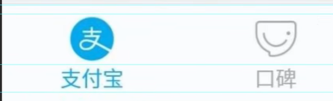

也可以设置中间的图标和字为两个项目（注意上下间隔），容器是从上到下整个盒子，容器设置主轴垂直，项目在容器中主轴方向居中


## P133

chrome检查的手机模式中，不仅可以设置模拟的手机分辨率，还能模拟其网络情况（网速差的时候应用会如何显示），可以设置横屏，在三个点的设置中还能截屏（案例素材get）


## P134

模拟器上显示的分辨率为css像素，也就是设备的独立像素

而物理分辨率则是设备真正的像素

设备像素比dpr = 物理像素 / css像素


一般来说，设计稿提供的是物理像素（为了更加清晰）并且只有一份，因此要求我们尽量

1. 使用百分比
2. 使用弹性盒
3. 使用rem


## P135

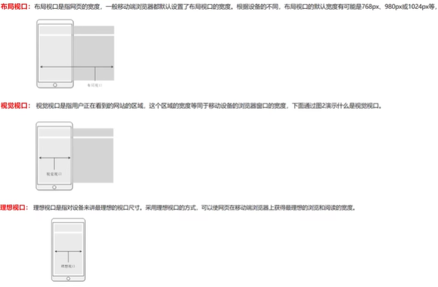

`<meta name="viewport" content="width=device-width, initial-scale=1.0, user-scalable=no">`

`viewport`：视口

`width=device-width`：理想视口=设备宽度

`initial-scale=1.0`：默认缩放为1，即不缩放

`user-scalable=no`：用户不允许缩放（不想用可以不加）

**在写移动端网站时一定不能忘记加这个**


## P136

移动端布局案例


## P137 P138

给一个盒子设置`overflow:auto`可以让盒子里面东西多时出现滚动条而不影响外面

sticky粘性定位

（之前讲的这些都有些模糊了... ）

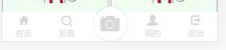

讲了中间这个照相机的做法：子绝父相脱离`flex:1`的限制，然后再微调，


## P139

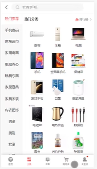

```html
// 对于中间那块
<section> // 设置overflow:auto避免把header和footer挤压走
    <ul> // 设置overflow:auto避免滚动条连着右边一起滚
        <li></li>
        <li></li>
        <li></li>
    </ul>
    <div>
        
    </div>
</section>

// 隐藏滚动条的方法:
::-webkit-scrollbar{
	// 对基于webkit内核的滚动条scrollbar进行样式修改
	display: none;
}
```


## P140

咕咕咕


## P141

水平滚动条

设置容器主轴水平，放入很多项目后，项目必然会被挤压显示，并不会出现滚动条

此时对项目设置`flex-shrink: 0;`不允许挤压，则项目不会被挤压，会一直向右延伸超出屏幕，再设置`overflow:auto;`即可达成水平滚动


弹性盒子部分结束撒花↑


## P142

多列布局（做瀑布流效果）

`column-count`：内容分成几列显示

`column-gap`：调整列间距

`column-rule`：设置列之间的分割线边框

`column-fill`：balance每列高度尽量平衡，auto每列尽量占满父盒子高度

`column-width`：调整列宽（调的不好可能无法达成分成的列数）

给子盒子设置的属性

`column-span`：all该盒子横跨所有列


## P143

多列布局案例

如果一个盒子因为多列布局被拦腰斩断了，一半在上一列最下面，一半在下一列最上面，而我们想避免这种事情，可以对盒子设置`break-inside:avoid`来避免它被斩断，禁止盒子内部折行

> 有的动态背景其实可能只是用一张动图当背景做到的


## P144

响应式布局：需要对相同内容进行不同宽度的布局设计

两种方式：

1. PC优先：从pc端开始向下设计
2. 移动优先：从移动端开始向上设计

无论如何设计，要兼容所有设备，布局响应时不可避免地需要对模块布局做一些变化，发生布局改变的临界点叫做断点


判断屏幕大小的方式：媒体查询

如果表达式为真，应用媒体查询中的css样式

```css
@media all and (min-width:320px) {
    body {
        background-color: red;
    }
}
// 对于所有的并且宽度大于320px的设备适用这些内容
```

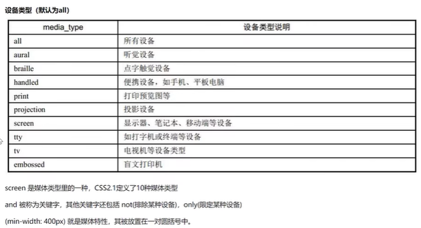

一般我们常用screen

`@media only screen and (min-width: 1029px) {}`：PC端或大屏幕设备，1028px及更大

`@media screen and (orientation:portrait) and (max-width: 720px) {}`：竖屏设备

`@media screen and (orientation: landscape) {}`：横屏设备


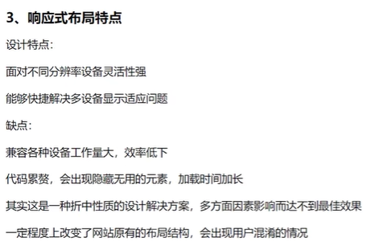

所以一般我们只会对内容少的公司展示官网这种做响应式


## P145

媒体查询中控制检测横屏竖屏的属性`orientation`其实就是在判断宽和高哪个大


## P146

如何让屏幕大时显示每行3个图片，屏幕小时每行2个：只需要媒体查询里面修改图片宽度的百分比即可

p146.html


## P147

rem布局（等比例缩放布局）：是移动端最好用的布局

1. `em`：相对于父元素的字体大小，如果父元素`font-size:16px`，那么此时1em=16px
2. `rem`：相对于根元素html的字体大小

显然，rem比em要方便很多


## P148

使用rem达成移动端自适应的前提是html的font-size是自适应的，为了达成这个，我们需要用js获取当前设备的宽度，进而来设置html的font-size

```js
document.documentElement.style.fontSize = document.documentElement.clientWidth / 750 * 100 + 'px'
// 是以iphone6的宽750px为基准进行计算的，此时在iphone6的分辨率下写的网页就可以适配其它分辨率的手机了
// fontsize = 当前设备的css布局宽度 / 物理分辨率（设计稿的宽度） * 基准font-size
// 一个设备750px，设计稿宽度是750px，基准font-size是100px,那么计算下来在这个设备上，1rem = 100px，即设计稿上量出来一个盒子宽100px，就写成1rem宽
```

为了解决文本的font-size问题，可以设置body的font-size为16px，然后下面的元素就都会从它这里继承字体大小而不是从html那里继承


> 可以在IDE里面安装一个px to rem插件，可以让我们正常写px，它来进行换算


## P149

rem案例

其实只是把之前写死的px写成rem

（别忘了图标也是文本，也需要写成rem）


## P150

`vh`：view-height，100vh = 视口的高度

`vw`：view-width，100vw = 视口的宽度

显然，vw和vh是自适应的，因此，我们可以用vw来代替上面的js代码，即使用vw来设置html的font-size


## P151

使用vw来设置html的font-size显然更为方便

> `width:100%;`和`width:100vw;`的区别
>
> 很显然，只要有了垂直滚动条，这两个就是不一样的（此时还会出现水平滚动条）
>
> 100vw 包含垂直滚动条 是视口大小（可以看作垂直滚动条下方还有一块，因此可以向右滚动看到多出的这一块）
>
> 100% 刨除垂直滚动条 占满剩余空间（向右滚动时右边就没了）
>
> 详细讲解在视频最后部分，要是忘了可以回去看


## P152

css3的主体上面已经讲完了，下面是一些小的部分

颜色渐变


线性渐变

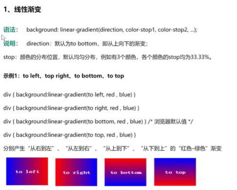

当然，可以写多种颜色的渐变，比如红色转黄色再转蓝色

并且可以设置每个颜色开始渐变的位置，如`red 0%, green 10%, blue 30%`，从0到10%是红过度到绿，从10%到30%是绿过度到蓝，再之后则是纯蓝

并且，方向还可以写斜向，如写成`to bottom right`就是从左上到右下渐变、

甚至方向还支持任意方向，如`10deg`就是10度方向进行渐变


## P153

径向渐变：一个点向四周渐变

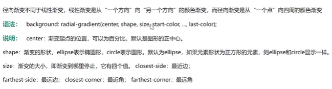

同样也可以不均匀过渡，方法和上面线性渐变一样

`center`的取值如`60% 40%`，则指中心点在水平60%，垂直40%处


该属性兼容性可能不太好，如果不兼容，则需要改成`background: -webkit-gradient`，这样就能支持如chrome浏览器了，如果要支持火狐，则前缀为`-moz`


## P154 

重复渐变

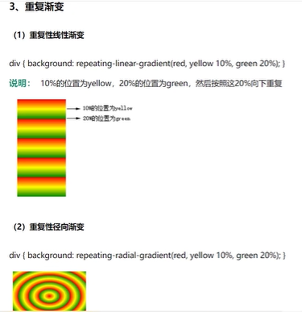


## P155

太极案例（我确实不会做.jpg）

p155.html


## P156

动画过渡

`transition`：让css属性在一定时间区间内平滑过渡

有四个值

1. 变化的属性：all/具体某个属性，也就是说如果有多个属性一起变，则只能写all，拆分开来的属性是`transition-property`
2. 过渡的持续时间：如5s，拆分开来的属性是`transition-duration`
3. 动画类型：linear匀速（默认）等，拆分开来的属性是`transition-timing-function`
4. 延迟时间：如3s，拆分开来的属性是`transition-delay`


```css
div {
    width:200px;
    height:200px;
    background:red;
    transition:height 2s;
}
div:hover {
    height: 600px;
}
// 此时，鼠标移上去时会渐渐变高，移开后又渐渐变回去
// 注意：transition必须写在div里而不是hover里，否则没有“渐渐变回去”的效果，而是突然变回去，这很好理解
```


所有属性都可以加动画，**除了`display: none/block`**

如果想做鼠标移到一级菜单上之后二级菜单缓缓出现的效果，可以将`ul`设置为`height:0; overflow:hidden`然后`ul:hover {height:200px}`


## P157

动画的过渡类型

1. linear：默认，匀速
2. ease：缓落
3. ease-in：加速
4. ease-out：减速
5. ease-in-out：先加速再减速
6. cubic-bezier()：贝塞尔曲线，可以去cubic-bezier.com看效果


## P158

过渡属性的拆分

之前说过，如果多个属性同时变，那么只能用all，但是如果我们不写复合属性而写拆分属性，则可以写多个

`transition-property: width height;`


## P159

2D属性 transform 变形


位移 translate

`transform: translate(x, y)`

水平方向位移x，垂直方向位移y

可以写百分数，此时**百分数是相对于自己的**

也有拆分`translateX`和`translateY`

写在比如`:hover`里面这个是没有平滑效果的，想要的话自己用`transition`加

直接写在盒子上则一开始出现的地方就是移动到的地方，类似相对定位


> 想要实现移动的动画，不使用translate也可以，直接设置相对定位配合动画过渡transition也能实现效果，但是我们一般不这么做
>
> 因为设置相对定位如left会导致浏览器回流重绘，而transform和opacity不透明度不会，它两是作为合成图层发送到GPU上，由显卡执行的渲染（即它们是在独立的一个图层上进行渲染，不会影响其它盒子）


## P160

缩放 scale

`transform: scale(x, y)`

X轴上放大成原来的x倍，Y轴上放大为原来的y倍

如果只写一个那就是两个方向一起放大

负值就是放大缩小的同时倒过来（一般不用）

同样也可以拆分成`scaleX()`和`scaleY()`

默认缩放是以盒子中心为中心进行缩放，如果想改变中心点，则需要设置`transform-origin:left top`将中心点设置为左上

如果要做盒子里面有图片，鼠标移过时图片放大的效果，建议设置盒子溢出隐藏，这样会好看些


## P161

2D旋转 rotate

`transform: rotate(10deg)`旋转10度

正值就是顺时针旋转，负值就是逆时针旋转

注意，`rotateX()`和`rotateY()`**并不是**它的拆分属性，这两个属性分别是在3D上绕着X和Y轴旋转，而`rotateZ()`就是`rotate()`

同样，也可以修改旋转中心，还是用`transform-origin`


## P162

旋转案例


## P163

2D 多属性同时使用

注意写的顺序

`transform: translateX(400px) scale(0.5)`是先位移400px再变小

`transform: scale(0.5) translateX(400px)`是先变小再位移200px

它们的结果显然是不一样的

同样，位移和旋转也要注意顺序，因为旋转会导致xy轴也跟着转

所以，为了达到我们希望的效果，我们应该**将位移写在最前面**

注：写多个`transform`的话后面的会覆盖前面的


## P164

2D 倾斜 skew

`transform: skew(x, y)`

x表示水平方向的倾斜角度，y表示竖直方向的倾斜角度

y可以不写，此时就是水平倾斜

可以拆分为`skewX()`和`skewY()`


水平方向倾斜：拽着盒子右下角往右拉，此时盒子右边和竖直方向的角度就是水平倾斜角度（如果是负的就是拽着左下角往左拉）

竖直方向倾斜：拽着盒子右下角往下拉，此时盒子下边和水平方向的角度就是竖直倾斜角度（如果是负的就是拽着左下角往下拉）


## P165

案例

> 溢出隐藏真好用，可以将被定位出父盒子的子盒子隐藏掉


## P166

还是案例


## P167

之前讲的过渡动画都必须是在交互的时候才有动画，想要让动画一直不停就需要下面的关键帧动画

关键帧动画 animation

`animation`：值如下

1. 动画名称：动画需要自己声明，声明方式如下，可拆分为属性`animation-name`
2. 持续时间：可拆分为属性`animation-duration`
3. 动画过渡类型：可拆分为属性`animation-timing-function`
4. 延迟时间：可拆分为属性`animation-delay`
5. 循环次数：可以写次数，也可以写infinite无限次，可拆分为属性`animation-iteration-count`
6. 控制动画执行最后的画面：none默认，forwards保留最后一帧的状态，backwards保留第一帧的状态，可拆分为属性`animation-fill-mode`
7. 是否反向运动：normal正常，reverse反向运动，alternate先正向再反向交替运行，alternate-reverse先方向再正向交替运行，可拆分为属性`animation-direction`


```css
// 声明动画ry
@keyframes ry {
    from{
        // 初始状态
        width:200px;
        height:200px;
        background:red;
    }
    
    to {
        // 最终状态
        width:400px;
        height:600px;
        background:green;
    }
}

@keyframes ry2 {
    0%{
        // 初始状态
    }
    
    50%{
        // 中间状态1
    }
    
    75%{
        // 中间状态2
    }
    
    100%{
        // 最终状态
    }
}
```


## P168

animation的拆分属性：上面写过了

还有一个拆分属性：`animation-play-state`

1. running：运行（默认）
2. paused：暂停


`animation-direction`动画方向，可以设置反方向来实现抽屉盒子缩回去的效果或者实现出场动画，这样就不用再声明一个动画了


## P169

轮播图案例

原理很容易想到，类似胶卷移动

一般会把第一张复制一份放在最后避免突兀

如何实现轮播图每张图片停一会的效果：在声明动画时声明几段时间画面完全相同即可

还可以用`animation-play-state`实现鼠标移上时暂停轮播效果


## P170

逐帧动画

需要每帧之间是跳跃过去的，而不是缓慢过渡过去

`animation-timing-function`属性还有一个值`steps()`，可以直接进行关键帧跳跃

`animation-timing-function: steps(x, y)`

x表示两个关键帧之间需要几步来过渡，设置为1就代表关键帧之间都是一步直接切换的

y有两个取值，end可以表示保留当前帧，即看不到最后一帧，动画结束，start表示保留下一帧，即看不到第一帧，从第一帧很快跳过去

`steps(1, start)等价于step-start`，`steps(1, end)等价于step-end`

一般用`step-end`，最后一帧放空白即可


## P171

animation动画库（其实就是个别人写好的css）

https://animate.style/

比自己写方便多了

> can i use 网站可以很容易看到属性的兼容性支持，并且如果需要前缀的话可以查到


## P172

3D动画

> X轴水平向右
>
> Y轴竖直向下
>
> Z轴从电脑屏幕向我们


在使用3D动画前必须先加上这个

`transform-style`：

1. `flat`：默认，二维
2. `preserve-3d`：三维

> 设置3D场地魔法（X


`transform: translateZ(100px)`向Z轴方向平移100px

注意：这并不会使得盒子看上去变大，因为默认情况下，我们可以认为我们离屏幕的距离相对于像素来说是正无穷，盒子向外移动一点自然不会有变化

如果想要实现近大远小的效果，需要给父盒子加上景深`perspective: 900px`

这表示我与屏幕之间距离900px


## P173

3D旋转

别忘了加`transform-style`


`transform:rotateX(30deg)`：沿着X轴顺着屏幕内外转

同样，也有`rotateY()`，`rotateZ()`（这个和2D效果一样）

`rotate3d(1,1,1,30deg)`：绕着x,y,z轴都转30度，前面三个值的取值是0-1，第四个值是度数基准


## P174

3D缩放

别忘了加`transform-style`


`transform: scaleX()/scaleY()`和2D效果相同

`scaleZ()`单独使用没有效果，需要配合加上景深`perspective`和设置旋转或位移才能显示出效果

同样也有`scale3d(1,1,10)`，x,y轴不变，z轴放大10倍


## P175

3D 立方体

需要6个div组合起来


## P176

网格布局：将网页划分为网格进行组合

> 弹性布局flex是轴线布局，只能指定项目相对于轴线的位置，可以看作是一维布局
>
> 网格布局grid是将容器看作由行和列组成的表格，可以指定项目所在的单元格，因此可以看作是二维布局

> 容器：一个项目中的最大父盒子
>
> 项目：容器里面的子盒子

网格线：划分网格的线，从左到右从上到下编号为12345...


设置网格布局

`display: grid`块级网格，容器从上往下排列（给行内元素设置它自然就会变成块元素）

`display: inline-grid`行内块级网格，容器从左往右排列（少用）


## P177

规定网格布局的行和列

`grid-template-rows: 200px 200px 200px`分成200px的三行

`grid-template-columns: 33.33% 33.33% 33.33%`分成等宽的三列

`grid-template-columns:repeat(3, 33.33%)`重复三次，每次切出33.33%，即分成等宽的三列，当然，第二个取值也可以不用百分比而用px

`grid-template-columns:repeat(auto-fill, 33.33%)`自动重复，每次切出33.33%，即分成等宽的三列，当然，第二个取值也可以不用百分比而用px

`grid-template-columns:100px 1fr 300px`第一列100px，第三列300px，第二列占满剩下的空间，`fr`和`flex:1`用法类似，也表示所占剩余空间的份数，所以自然也有`grid-template-columns: 1fr 2fr 1fr`

`grid-template-columns:minmax(100px, 200px) 200px 300px`先满足正常设置的几列的宽度，然后再看剩下的宽度够不够给设置了`minmax`的列的，如果够，就全给它直到200px为止，哪怕会空出地方，如果不够，也得给它100px，哪怕会溢出

`grid-template-columns:100px auto 300px`中间自动填满剩余空间


## P178

`grid-row-gap: 20px`行间距

`grid-column-gap: 20px`列间距

`grid-gap: 30px 30px`

新版中grid前缀可以省略


## P179

划分区域

```css
// 以三行三列为例
grid-template-areas:'a b c'
					'd e f'
					'g h i';
// 这就表示这是给了9个子盒子的位置
grid-template-areas:'a a c'
					'd e f'
					'g h i';
// 这样第一行的前两格就被合并了
```

子盒子占领地盘的方法：给子盒子设置如`grid-area: a`，则子盒子会占据名为a的地盘


## P180

案例


## P181

网格布局对齐方式


改变网格项目放置方向

`grid-auto-flow`：

1. `row`：默认，从左到右然后换行继续
2. `column`：从上到下然后换行继续

控制网格在容器中的显示方式

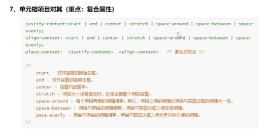

显然，只有划分的网格比容器要小，才能自由修改位置


控制项目在网格中的显示方式

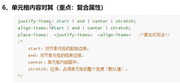


## P182

给网格中的项目加属性

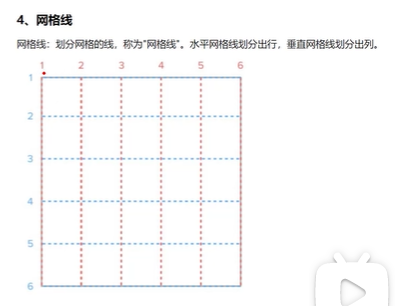

`grid-column-start`：项目左边框所在的垂直网格线编号

`grid-column-end`：项目右边框所在的垂直网格线编号

`grid-row-start`：项目上边框所在的垂直网格线编号

`grid-row-end`：项目下边框所在的垂直网格线编号

简写`grid-column: 2/4`，`grid-row: 2/4`


## P183

html css 杀青！
