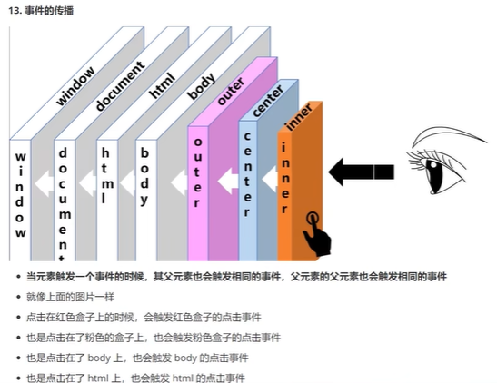

## P101

鼠标的事件对象属性分析

1. `clientX` `clientY`：距离浏览器可视窗口左上角的坐标值

   如果滚动了页面，显然可视窗口会改变，该属性值也会变

2. `pageX` `pageY`：距离文档左上角的坐标值

   不会改变

3. `offsetX` `offsetY`：距离触发事件的元素的左上角的坐标值


## P102

案例 鼠标跟随

p102.html

```js
    box.onmousemove = function(evt) {
        this.firstElementChild.style.left = evt.offsetX + "px"
        this.firstElementChild.style.top = evt.offsetY + "px"
    }
// 这里会出现的问题是，鼠标抖动到p标签上时，offsetX和Y就会变成相对于p元素计算，显然此时就会变成0，因此会出现不停闪的现象

// 解决方法1
// 设置p标签离鼠标远一点即可
    box.onmousemove = function(evt) {
        this.firstElementChild.style.left = evt.offsetX + 50 + "px"
        this.firstElementChild.style.top = evt.offsetY + 50 + "px"
    }

// 解决方法2
// 给p标签设置样式 pointer-events: none
```


## P103

案例 鼠标拖拽

p103.html


## P104

DOM事件流

**当元素触发一个事件时，其父元素也会触发相同的事件，再往上的父元素等都会触发这个事件**

无论父元素有没有设置这个事件，事件都会一层层往上传播




标准的dom事件流：

捕获：window => document => body => outer

目标：inner

冒泡：outer => body => document => window

但是默认情况下，事件**只会在冒泡阶段触发**

要想触发捕获阶段的事件处理函数，需要使用dom2进行绑定并配置（很少用）

`outer.addEventListener("click", function(){}, true)`该事件会在捕获阶段触发（ie678不兼容，只能用默认情况）


事件流永远是这样走，区别只是每一层有没有监听事件

> 注意：事件传播是往父元素方向传播，和实际上盒子的位置无关，就算你定位到了一个空白的地方，事件照样会传给父元素


## P105

阻止事件传播

```js
box.onclick = function(evt) {
    ...
    evt.stopPropagation() // 停止冒泡，阻止事件传播
    
    // ie 678 不支持这个，需要用下面这个
    // 虽然现在已经没有人用ie 678了
    evt.cancelBubble = true
}
```


## P106

阻止默认行为

在dom0中，只需要在要阻止默认行为的事件处理函数中加上`return false`即可，如

```js
document.oncontextmenu = function(){
    ...
    return false
}
```

即可阻止浏览器自带的右键菜单


在dom2中需要用这种方法

```js
document.addEventListener("contextmenu", function(evt){
    evt.preventDefault() // 阻止默认行为
    // ie 678 还是有兼容性问题，需要改成下面这个
    evt.returnValue = false
})
```


## P107

案例 自定义右键菜单

p107.html

感觉还不错


## P108

事件委托：把子元素要触发的事件委托给父元素去做

由于冒泡机制，子元素触发事件时，父元素也一定会触发相同事件，因此事件委托是可行的

此外，我们还需要让父元素知道到底是哪个子元素触发了事件

事件对象中有属性`target`，表示触发事件的是哪个元素

（还是ie678，需要换成`evt.srcElement`，所以或一下就行）


比如上面的右键自定义菜单，就可以让父元素ul去处理每个li触发的事件，这样可以减少多个函数绑定的性能损耗，并且适配性更好，以后再加新的节点的话，有可能就可以直接适配上去