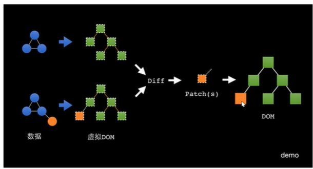
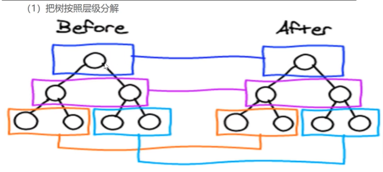
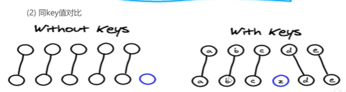
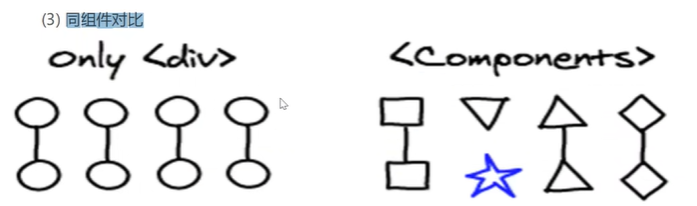

## p1

Kerwin老师真容.jpg


## p2

Vue（中二）地图


## P3

Vue专治各种DOM不服


## P4

> 一开始是从Vue2开始讲起

Vue2的引入方式

```html
<script src="....."></script>
<body>
    <div id="box">
        {{10 + 20}}
        {{ myname }}
    </div>
    <script>
    	let vm = new Vue({
            el: "#box", // element，表示#box被纳入Vue管辖
            data: {
                myname: "rr" // 这个叫做 状态
            }
        })
        vm.myname = "kk" // myname实际上是被挂在vm下
    </script>
</body>
```

原来想改myname内容需要找到节点然后修改，现在只需要修改状态即可


## P5

拦截原理

```js
let obj = {
    
}

Object.defineProperty(obj, "myname", {
    // 对obj对象定义了一个myname属性，该属性被获取或者赋值时会走以下两个方法
    get: function(){
        return box.innerHTML
    },
    set(value){
        // value是被赋的值
        box.innerHTML = value
        // Vue修改状态就能修改节点内容的原理大概就是这样
    }
})
```

这是Vue2中使用的拦截原理，它的缺点如下

1. 无法监听ES6的Set，Map变化
2. 无法监听Class类型数据
3. 无法监听属性的新增和删除
4. 无法监听数组元素的增加和删除

因此，在Vue3中，我们使用ES6 Proxy来代替它（IE不支持这个，所以如果Vue3检测到IE，会自动降级为Vue2的监听系统）


## P6

Vue模板语法

```html
<div id="box">
    {{10>20?'aaa':'bbb'}}
    // {{}}里面支持表达式
    <div :class="whichcolor"></div>
    // :表示绑定变量(也支持表达式)
    <div :class="isColor?'aaa':'bbb'"></div>
    // 其实一般如果要改class的话是这样改，里面显然isColor是变量
    
	<button @click="handleChange()"></button>
    // @表示绑定事件
	// JS里面学的各种事件都可以类似地加上来，如@mouseover
</div>
```


```js


let vm = new Vue({
    el: "#box",
    data: {
    	myname: "rr",
        whichcolor: "aaa",
        isColor: true
	},
    methods: {
        handleChange(){
            this.myname = "aa"
            this.whichcolor = "bbb" // 修改class也很容易
            this.isColor = !this.Color
        }
    }
})

```


## P7

指令：

1. `v-show`：`<div v-show="isShow"></div>`，isShow为data中定义的状态，这个指令用于控制节点的动态显示和隐藏

2. `v-if`：和上面类似，用于控制节点动态创建和删除

   > `v-if`比`v-show`懒惰：当都为false时，`v-show`的节点其实已经创建好了，只不过加上了`display: none`，而`v-if`等到设置为true时才会创建节点（`v-if`再设置为false的话节点会被删除）

3. `v-for`：列表渲染指令

   ```html
   <ul>
       <li v-for="item in list">
       	{{item}}
       </li>
   </ul>
   
   <ul>
       <li v-for="(item, index) in list">
       	{{item}}-{{index}}
           // 还能拿到索引
       </li>
   </ul>
   ```

   ```js
   new Vue({
       el: ....,
       data: {
           list: [1, 2, 3, 4]
       }
   })
   ```

4. `v-bind`：动态绑定属性指令，`v-bind:src`等价于`:src`

5. `v-on`：动态绑定事件指令，`v-on:click`等价于`@click`

6. `v-model`：双向绑定表单value（上面两个都是单向绑定）

   `<input type="text" v-model="mytext"></input>`


## P8

案例 todolist 

> ```html
> <ul v-show="list.length">
>     <li v-for="(item, index) in list">
>         {{item}}
>         <button @click="handleChange(index)">
>             del
>         </button>
>     </li>
> </ul>
> ```
>
> ```js
> new Vue({
>     el: ....,
>     data:{
>     	list: [1, 2, 3, 5]
> 	},
>     methods: {
>         handleChange(index){
>             this.list.splice(index, 1)
>         }
>     }
> })
> ```


## P9

v-html

```html
<div id="box">
    {{mytext}}
    // 这里不会解析出标签，为了防止跨站脚本攻击XSS
    <div v-html="mytext">
        // 这里会解析成标签，注意一般只对受信任的来源如后端使用
    </div>
</div>
```

```js
new Vue({
    el: "#box",
    data: {
        mytext: "<b>kkkk</b>"
    }
})
```


## P10

案例 点击高亮

```html
<ul>
    <li v-for="(item, index) in list" :class="current === index ? 'active': ''">
    	{{item}}
    </li>
</ul>
```

如果当前点击的是该盒子，则设置样式高亮


## P11

Vue2的class&style

上面用三目运算符显然无法解决大多数关于修改类的问题，比如同时需要修改多个类名，`class="aa bb"` => `class="cc bb dd"`

动态切换class：

1. 对象方法：

   ```html
   <div :class="classobj">
       
   </div>
   ```

   ```js
   let vm = new Vue({
       el: "#box",
       data: {
           classobj: {
               aa: true,
               bb: true,
               cc: false
           }
           // 这里的aa bb cc是类名
       }
   })
   ```

   想要切换class只需要设置classobj属性的true和false即可

   清晰明了

   但是也有问题

   如果我们`vm.classobj.dd = true`，那么这个新增的属性不会被拦截，没有get和set方法，也就无法正常使用（Vue2只会给初始化时候的属性加上拦截，它无法监听属性的新增和删除）

   Vue2的解决方法：亡羊补牢

   > `Vue.set(vm.classobj, "dd", true)`给classobj对象增加dd属性，初始化为true并添加拦截

   Vue3的解决方法：Vue3支持动态添加属性的拦截，什么都不用做

2. 数组方法：

   ```html
   <div :class="classarr">
       
   </div>
   ```

   ```js
   let vm = new Vue({
       el: "#box",
       data: {
           classarr: ["aa", "bb"]
       }
   })
   ```

   尝试新增数组元素`vm.classarr.push("dd")`，发现有效，但是实际上Vue2无法监听数组元素的增加和删除，之所以这里有效是因为Vue2重写了push方法，加入了监听

   Vue3显然也不会有这样的问题


动态切换style：

1. 对象方法：

   ```html
   <div :style="styleobj">
       
   </div>
   ```

   ```js
   new Vue({
       el: "#box",
       data: {
           styleobj: {
               backgroundColor: 'red'
           }
       }
   })
   ```

   和上面的class相同，也不支持动态添加属性，解决方法也和上面相同

2. 数组方法：

   ```html
   <div :style="stylearr">
       
   </div>
   ```

   ```js
   new Vue({
       el: "#box",
       data: {
           stylearr: [{backgroundColor: 'red'}]
       }
   })
   ```

   一样的

​	

## P12

Vue3的class&style

> Vue3和Vue2的初始化方法不同：
>
> Vue2面向对象式
>
> ```js
> new Vue({
>     el: "#box",
>     data: {
>         myname: "aaa"
>     }
> })
> ```
>
> Vue3函数式
>
> ```js
> let obj = {
>     data(){
>         return {
>             myname: "aaa"
>             // 写在返回值中是因为，如果有两个组件，即使变量名称相同也不会冲突
>         }
>     },
>     methods: {
>         handleChange(){
>             console.log(this.myname)
>         }
>     }
> }
> Vue.createApp(obj).mount("#box") // 挂载到box节点上
> ```
>
> **从Vue2到Vue3，上面学的其它东西都不变**
>
> 

Vue3支持动态添加对象属性和数组元素，实现上一节的操作完全没有问题


## P13

条件渲染 v-if

使用场景：如后端返回商品数据，其中state表示商品状态如已支付，未发货等

```js
new Vue({
    el: "",
    data: {
        datalist: [
            {
                title: "1111",
                state: 0
            },
            {
                title: "2222",
                state: 1
            },
            {
                title: "3333",
                state: 2
            },
            {
                title: "4444",
                state: 3
            }
        ]
    }
})
```

```html
<ul>
    <li v-for="item in datalist">
        {{item.title}}
        <span v-if="item.state===0">未支付</span>
        <span v-else-if="item.state===1">已支付</span>
        <span v-else-if="item.state===2">未发货</span>
        <span v-else>已发货</span>
    </li>
</ul>
```


想让多个盒子同时受控制：

```html
<div>
    <template v-if="isTrue">
    	<div>1</div>
        <div>2</div>
        <div>3</div>
    </template>
</div>
```

template是包装标签，不会出现在页面上，不会破坏DOM结构

当然这里template也可以使用div，但是如果使用div就会破坏外层div和内层div的父子关系


## P14

列表渲染 v-for

`<div v-for="item in list"></div>`等价于

`<div v-for="item of list"></div>`


> `<li v-for="(item, key) in obj"></li>`
>
> 你甚至可以用v-for遍历对象，其中key是键，item是值
>
> （虽然这没有意义
>
> （数组其实也是对象


```html
<ul>
    <li v-for="item in 10"></li>
    // item从1到10
</ul>
```


## P15

v-for中的key值

假设我们要用v-for去渲染一个li

首先有一个列表`[111, 222, 333]`，然后Vue会先创建一个虚拟DOM节点

> 虚拟DOM节点：用JS对象描述的节点
>
> 类似这样
>
> ```js
> [
>     {
>         tag: 'li',
>         text: 111
>         children: [......]
>     }
> ]
> ```

接着，Vue会根据虚拟DOM节点去创建真实的DOM节点，二者是一一映射的关系

然后我们删去列表中的一个元素，现在列表变成了`[111, 333]`

于是Vue会再去创建一个新的虚拟DOM，然后和老的虚拟DOM进行对比，将差异处标记出来形成一个补丁，最后更新到真实DOM中

> 为什么要创建虚拟DOM去对比：因为创建真实DOM的代价很大，一个真实节点里面有很多很多属性，但是虚拟DOM节点就不需要有这些属性，只要有核心属性即可

> 新老虚拟DOM是如何进行对比的：key相同的进行对比
>
> 因此，我们不应该把key设置为index，如果设置为index，那么当我们从中间删去某个元素时，对比的时候后面就会错开导致对比出很多无用的差异
>
> ```html
> <li v-for="(item, index) in list" :key="item.id"></li>
> ```
>
> 理想的key是使用唯一不重复的id
>
> key的作用：跟踪节点的身份，从而重用和重新排序现有元素
>
> 因此，以后使用v-for时不管用不用到**必须加上合理的key**，这是为了以后Vue能复用老的节点，用最小的代价去更新节点


> 先通过Object.defineProperty方法设置拦截，属性修改时通过set方法通知watcher，watcher收录着所有用到该属性的组件，然后创建新的虚拟DOM和老的进行对比，用最小的代价对真实DOM进行更新


> 虚拟DOM => virtual dom / vdom
>
> 虚拟节点 => virtual node / vnode


## P16

检测数组变动

[在Vue2中]

大部分修改原数组的方法都会被检测到并更新页面

（虽然实际上它们都没有被拦截，只是被Vue重写了方法顺便通知页面更新）

但是下面这个完全就检测不到

`vm.list[0] = "111"`

Vue2的解决方法

1. `vm.list.splice(0, 1, "aaa")`在索引0删除一位再添加一个，强行使用方法
2. `Vue.set(vm.list, 0, "aaa")`

**注意，在Vue3中完全没有这种问题，可以随便改**


## P17

案例 模糊查询

```js
// arr: ["aaa", "abc", "ccc"]
let newArr = arr.filter(item => item.includes("a"))
// 过滤出包含a的
```


## P18

案例续

```html
<div id="box">
    <input type="text" :v-model="mytext"/>
    <ul>
        <li v-for="item in search()" :key="item">
        	{{item}}
        </li>
    </ul>
</div>
```

```js
new Vue({
    el: "#box",
    data: {
        mytext: "",
        datalist: ["aaa", "bbb", "abc"]
    },
    methods: {
        search(){
            return this.datalist.filter(item => item.includes(this.mytext))
        }
    }
})
```

**包括{{}}，里面其实都是可以放函数的**，值就是函数返回值

> mytext的改变被拦截，使用到它的search函数也会重新执行一次

> 状态改变，不仅相关的DOM节点会更新，用到的函数也会重新执行


> ```html
> <li v-for="item in search()" :key="item">
> 	{{item}}
> </li>
> ```
>
> （下面P27学了计算属性后知道，这里不应该放方法，应该改成计算属性）


## P19

事件处理器

1. 函数表达式：`@click="func()"`
2. 函数名：`@click="func"`
3. 直接写表达式：`@click="count++"`

这两种都可以，区别在于如果用`func`不加小括号，那么会自动有一个参数evt表示事件对象，`evt.target`就是事件绑定的那个元素，而如果是`func()`，那不写参数就是没有参数

另外，如果想要自己传参那只有用函数表达式方法，如果即要传参又想拿到事件对象，那么需要`@click="func($event, 1, 2, 3)"`可以得到事件对象event并传入参数1 2 3，并且这个$event是固定的


## P20

事件修饰符 语法糖

`<li @click.stop="func"></li>`

`.stop`表示阻止冒泡


`<ul @click.self="func"></ul>`

`.self`表示不会被子元素冒泡触发


应用场景：比如点击按钮弹出一个输入框，同时四周背景变成暗色，点击四周背景会关闭弹出框

实现方法是点击按钮出现一个和界面一样大的透明暗盒子，然后再在中间出现一个包含输入框的盒子，现在的问题是你点击输入框时由于冒泡也就相当于点击了透明暗盒子，导致它连着输入框盒子一起被隐藏

显然这里需要设置阻止冒泡


还有几个不是很常用的修饰符

`.once`只能触发一次

`.prevent`阻止默认行为，如`<a href="xxx.com" @click.prevent="func"></a>`可以避免点击后直接跳转走


## P21

按键修饰符 也是语法糖

`.enter`：`<input type="text" @keyup.enter="func"/>`就是回车后键盘弹起时触发（不过没有这个我们照样可以从事件对象中拿到keycode然后判断是不是回车）

`.esc` `.up` `.down` `.left` `.right` `.space` `.ctrl` `.shift`  `.delete`等常见的都有

并且可以连着写，如`@keyup.enter.ctrl`是在同时按下ctrl和回车键盘弹起后触发

其它的按键也可以绑，只需要知道它的keycode就行如`@keyup.13`


## P22

表单控件绑定（Vue在富表单应用中能大大提升效率）

1. 单个多选框

   ```html
   <input type="checkbox" v-model="isRemember"/> 记住用户名
   ```

   ```js
   new Vue({
       el: "#box",
       data: {
           username: localStorage.getItem('username'),
           isRemember: false
       }
   })
   ```

2. 多个多选框

   ```html
   <input type="checkbox" v-model="checkList" value="vue"/> vue
   <input type="checkbox" v-model="checkList" value="react"/> react
   <input type="checkbox" v-model="checkList" value="wx"/> wx
   ```

   ```js
   new Vue({
       el: "#box",
       data: {
           checkList: []
       }
   })
   ```

   value和实际多选内容不需要一样，当被勾选后checkList中就会出现被勾选项的value

3. 单选框

   ```html
   <input type="radio" v-model="select" value="a"/> 男
   <input type="radio" v-model="select" value="b"/> 女
   <input type="radio" v-model="select" value="c"/> futa
   ```

   ```js
   new Vue({
       el: "#box",
       data: {
           select: ""
       }
   })
   ```

   连name也不用设置了，设置同一个v-model就是一组的


> Vue是mvvm类型的框架，特性就是双向数据绑定


## P23

案例 购物车

见 P23.html

> 不能死脑筋，比如多选框的value，我们不一定非得设置成id，如果后面我们不知道里面哪些属性要用到，可以索性设置为整个item


## P24

续

> `for`和`for of`都可以获取元素内容，而`for in`获取的是元素索引
>
> 当然，`list.forEach`获取的也是元素内容

> 再次强调，{{}}里面可以放函数如计算总金额时`{{ sum() }}`
>
> （下面P27学了计算属性后知道，这里不应该放方法，应该改成计算属性）

> Vue是细粒度的数据驱动更新

> Vue的拦截是深度拦截——你改了对象里面的某个属性那么和这个属性这个对象相关的所有地方都会改变


## P25

`<input type="checkbox" v-model="isAll" @click="clickAll"> 全选/全不选`

在click触发时，v-model还没有同步完成，所以会出现问题

所以一般需要用change事件


全选功能看起来简单，但是和其它一堆功能混起来就容易产生很多BUG，建议看看代码


## P26

表单修饰符

众所周知，双向绑定是很勤快的，状态改变瞬间相关的东西都会变

`<input type="text" v-model.lazy="mytext"/>`如果加上这个，那么状态只会在失去焦点时才改变


还有`.number`可以让输入内容变成数字类型（默认是字符串）（没什么用.jpg）

`.trim`去除首尾空格


## P27

计算属性：为了获得一个结果的逻辑应放在计算属性中写


原则：模板不能过重，即DOM中不能写长的逻辑如下面这个

首字母大写`{{ name.substring(0, 1).toUpperCase() + name.substring(1) }}`

而计算属性就可以防止模板过重难以维护，改成如下这样

```html
{{ myComputedName }}
```

```js
let vm = new Vue({
    el: "#box",
    data: {
        name: "rr"
    },
    // 下面这个里面是专门放计算属性的
    computed: {
        myComputedName(){
            return this.name.substring(0, 1).toUpperCase() + this.name.substring(1)
        }
    }
})
```

计算属性与函数职责不同，**计算属性就是为了计算得到一个结果**，而函数用于处理事件等

注意模板字符串中写的计算属性**不能加小括号**，加上小括号就变成方法了，Vue会去方法里面找

尽管使用方法也能得到看上去一样的结果，但是这有个弊端

```html
{{ myComputedName }}
{{ myComputedName }}
{{ myComputedName }}

{{ myComputedName() }}
{{ myComputedName() }}
{{ myComputedName() }}
```

计算属性只会执行一次并存进缓存，再用到会从缓存里拿，而下面的这个方法会执行三次

当然，计算属性的缓存是有依赖的缓存，里面用到的值变了自然也会重新计算

> 计算属性里面只能同步，因为需要立即得到结果


## P28

案例 计算属性

把之前的几个案例里面用的不对的地方改成计算属性

> 但是计算属性没法传参，所以有的时候还是只能用函数


## P29

watch监听

计算属性等需要立刻拿到结果的地方我们无法使用异步代码，如请求后端拿数据

以之前的模糊查询为例，每输入一个字符都需要请求一次后端，这里靠双向绑定和计算属性就无法做到了（因为异步）

我们需要watch来监听状态改变，然后进行处理

```html
<input type="text" v-model="mytext"/>
```

```js
new Vue({
    el: "#box",
    data: {
        mytext: ""
    },
    watch: {
        mytext(newval){
            // newval就是监听到的新值
            // 这里面写异步函数然后去更新其它状态啥的都可以
        }
    }
})
```

这里watch里面的mytext函数监听的就是data中的mytext状态改变，注意名称必须相同

每次mytext值改变，mytext函数都会执行

> data：状态，被拦截
>
> methods：方法，事件绑定，逻辑计算，可以没有return，没有缓存
>
> computed：计算属性，解决模板过重问题，必须有return，重视结果，有缓存，同步
>
> watch：监听，监听值的改变，不用return，异步和同步都可以，重视过程


## P30

fetch-get

> 之前js那一块讲过了不过再听一遍也没关系
>
> 我直接把那一块的笔记搬过来了↓


xhr的API实现非常混乱，因此我们有了fetch

> ajax是异步请求数据，局部更新页面的技术，xhr是它的一种实现，fetch取代的是xhr
>
> 当然也有兼容性的一些小问题
>
> （github上有兼容库polyfill，可以解决兼容问题（用看上去是fetch的方法封装xhr））

fetch是基于promise封装起来的

```js
// GET
fetch(url).then(res => {
    return res.json() // 这个返回的其实也是promise
    // 这个返回的promise解析后是json对象
    // 如果改成res.text()，返回的promise解析后就是json字符串
}).then(res => {
    console.log(res) // 这才得到了res
})

// fetch的问题是需要你自己去处理错误情况
// 如果自己不处理，那么不会走到catch分支
fetch(url).then(res => {
    if (res.ok) return res.json
    else {
        // 拒绝承诺
        return Promise.reject({
            status: res.status,
            statusText: res.statusText
        })
    }
}).then(res => {
    
}).catch(err => {
    
})

// POST
fetch(url, {
    method: "POST",
    header:{
        "content-type": "application/json"
        // 如果是x-www-formurlencoded的话，body里面放的就是类似name=aaa&age=100这种
    },
    body:JSON.stringify({
        username: "aaa",
        password: "123456"
    })
}).then(res => res.json())
.then(res => {
    
})

// PUT
fetch("http:localhost:3000/users/2", {
    // 使用json-server时默认需要这样写，修改的是id为2的内容
    method: "PUT",
    header:{
        "content-type": "application/json"
    },
    body:JSON.stringify({
        username: "aaa",
        password: "123456"
    })
}).then(res => res.json())
.then(res => {
    
})

// PUT会全部覆盖，PATCH只是部分修改

// DELETE
fetch("http:localhost:3000/users/2", {
    // 使用json-server时默认需要这样写，修改的是id为2的内容
    // 写?id=2也行
    method: "DELETE"
}).then(res => res.json())
.then(res => {
    
})
```


## P31

fetch-post

见上面


## P32

fetch应用

> 一个网站，如果检查看到源码只有一点点，那么很明显这是个前后端分离的项目，我们可以尝试去过滤它的fetch&xhr请求，或许能找到后端返回的东西


## P33

axios

> fetch是标准，是可以直接用的，但axios不是，axios是第三方库，是需要下载的，但是Vue推荐我们用这个库

> 不知道怎么下建议去npm搜

```js
axios.get(url).then(res => {
    console.log(res.data)
})
axios.post(url, "name=aaa&age=100").then(res => {})
axios.post(url, {name: "aa", age: 100}).then(res => {})
```

可见axios比fetch要更加简单


## P34

案例 猫眼数据


## P35

过滤器

计算属性无法传参，所以有的地方不得不用函数如

```html

```

但是Vue2不愿意这样，它使用过滤器来代替

```html

```

```js
new Vue({....})
Vue.filter("imgFilter", url => {
    return url + "@adaddafv"
})
```

过滤器`a | b | c ...`可以一直连下去，运行方式是将a作为参数放入b中执行，得到的返回值作为参数再放进c执行...如此下去


**虽然但是，视频结尾告诉我们，Vue3不支持过滤器**


## P36

> 上面35集学的部分已经可以把Vue单纯当成一个模板来用了，下面则是更深入，更好的一些使用

组件：将DOM，CSS和JS代码封装到一起来提供简便的复用

创建全局组件：

Vue2

```html
<div id="box">
    <navbar></navbar>
</div>
```

```js
// 定义全局组件
Vue.component("navbar", {
    template: `<div style=".....">
    这是导航栏{{ name }}
    <button @click="func">菜单</button>
    <child></child>
    </div>`,
    methods:{
        func(){
            
        }
    },
    computed:{},
    watch:{},
    data(){
        return {
            name: "rr"
            // 注意这里的data必须是函数式写法，和Vue3的相同
        }
    }
})
// 组件内部还能接着套组件，navbar组件内的child组件定义如下
// 注意：这也是全局的，因此在html中直接用可以，在其它组件中用也可以
Vue.component("child", {
    template: `<div style=".....">
    这是child
    </div>`,
})

// 这其实是在创建根组件
new Vue({
    el: "#box"
})
```

现在，`navbar`组件就代表着里面写的那个带按钮的div盒子，包括点击事件等

在组件化的开发中，body内写的是一些组件，组件则分别定义，这样可以使DOM结构更加清晰明了

> 注意：
>
> 1. 组件名称不要用驼峰写法，而应该用`-`连接
> 2. DOM片段没有高亮没有代码提示（后面会使用Vue单文件组件解决）
> 3. CSS只能写行内样式（后面会使用Vue单文件组件解决）
> 4. 所以组件都在一起太混乱了（后面会使用Vue单文件组件解决）
> 5. 组件内的data写法注意
> 6. 组件是孤岛，内外不直接连通，只能间接连通
> 7. template里面必须只包含一个根节点，如`<div></div><div></div>`就不行


## P37

创建局部组件

```js
// 这是全局组件
Vue.component("navbar", {
    template: `<div style=".....">
    这是导航栏{{ name }}
    <button @click="func">菜单</button>
    <child></child>
    </div>`,
    methods:{
        func(){
            
        }
    },
    computed:{},
    watch:{},
    data(){
        return {
            name: "rr"
            // 注意这里的data必须是函数式写法，和Vue3的相同
        }
    },
    components:{
        // 这是局部组件，只能在navbar组件内部使用，外部无法使用
        "child":{
            template: `<div>局部子组件</div>`,
            methods:{},
            ....
        }
    }
})
```


## P38

父传子（父组件在使用孩子组件时给孩子组件传属性）（实现组件复用的必需品）

> 子组件需要使用父组件的变量：不能直接使用，需要父组件传参，子组件接收参数才能拿到
>
> （如果父组件要传的是data里面定义的变量，写属性时候记得加`:`前缀）

```html
<div id="box">
    // 此时navbar放在box组件（根组件）的模板内，为根组件的子组件
    <navbar myname="aaa" :show="false"></navbar>
    // :show表示后面的用js解析，即布尔值，而myname表示后面的是字符串
    <navbar myname="bbb" :show="true"></navbar>
</div>
```

```js
Vue.component("navbar", {
    props:["myname", "show"], // 接受外面传进来的属性 
    template: `<div style=".....">
    {{ myname }}
    <button @click="func" v-show="show">菜单</button>
    </div>`
})
```


## P39

属性验证和默认属性

```js
Vue.component("navbar", {
    // props:["myname", "show"], // 这种方式不是很安全，无法验证属性类型，因此改用下面这种进行属性验证
    // props:{
    //    myname: String,
    //    show: Boolean
    // }
    // 但是这样如果父组件没传够参数，会出现undefined这种东西，不好，我们还需要给参数加上默认值
    props: {
        myname: {
            type: String,
            default: ""
        },
        show: {
            type: Boolean,
            default: true
        }
    }
    template: `<div style=".....">
    {{ myname }}
    <button @click="func" v-show="show">菜单</button>
    </div>`
})
```


## P40

子传父

子传父的使用场景：

```html
<div id="box">
    <a></a>
    <b v-show="isShow"></b>
</div>
```

```js
Vue.component("a", {
    template: `<button></button>`
})

Vue.component("b", {
    props: {
        isShow: {
            type: Boolean,
            default: true
        }
    }
    template: `<div v-show="isShow">1111</div>`
})

new Vue({
    el: "box",
    data(){
        isShow: true
    }
})
```

想实现点击a时改变b的显示与隐藏

我们需要在点击a时，让a组件通知父组件改变isShow的值，进而控制b组件的状态


## P41

子传父实现

```html
<div id="box">
    <a @myevent="handleEvent"></a>
    <b v-show="isShow"></b>
</div>
```

```js
Vue.component("a", {
    template: `<button @click="handleClick()"></button>`,
    methods:{
        handleClick(){
            this.$emit("myevent"， "aaaaa")
            // 触发父组件给它绑的监听事件myevent并传个了参数过去
            // 这个参数会被myevent事件绑定的函数handleEvent接受到
        }
    }
})

Vue.component("b", {
    props: {
        isShow: {
            type: Boolean,
            default: true
        }
    }
    template: `<div v-show="isShow">1111</div>`
})

new Vue({
    el: "box",
    data: {
        isShow: true
    },
    methods: {
        handleEvent(data){
            this.isShow = !this.isShow
            console.log(data) // aaaaa
        }
    }
})
```


> 父传子靠属性，子传父靠事件


## P42

案例 中间人模式

> Vue中兄弟组件无法相互通讯，只能通过父组件进行间接通讯


## P43

> 上一节我们解决了兄弟组件通讯的问题，但是如果不是兄弟而是比如叔侄，那么再用这种方法通讯就会很繁琐

有两个解决方案：

1. 中央事件总线bus：可以处理只有一处需要通讯，但是层级比较多的情况
2. Vue全家桶中的vuex，专门用于状态管理：可以处理有很多很复杂的组件相互通讯的情况


bus的原理是订阅发布模式

```html
<div id="box">
    <a></a>
    <b></b>
</div>
```

```js
let bus = new Vue()

Vue.component("a", {
    template: `<button @click="handleClick">发布者</button>`,
    methods:{
        handleClick(){
            bus.$emit("myevent"， "aaaaa") // 触发myevent事件
        }
    }
})

Vue.component("b", {
    template: `<div>订阅者 {{ mytext }}</div>`,
    data(){
        return {
            mytext: ""
        }
    },
    mounted(){
        // 这是一个生命周期函数，在当前组件上树后自动执行
        // 监听myevent事件
        bus.$on("myevent", data => {
            console.log(data) // aaaaa
            this.mytext = data
        })
    }
})

new Vue({
    el: "box"
})
```

在根组件之外创建一个空组件用来当做事件总线，负责进行事件的触发和监听，以此来帮助通讯


## P44

ref组件通讯

> ref 引用

> ref绑定在dom节点上，获取的就是dom对象
>
> ref绑定在组件上，获取的就是组件对象

```html
<div id="box">
    <input type="text" ref="mytext"/>
    <button @click="handleGet">
        get
    </button>
    <child ref="mychild"></child>
</div>
```

```js
Vue.component("child", {
    template: `<div>child</div>`,
    data(){
        return {
            myname: "aaaaaa"
        }
    }
})

new Vue({
    el: "#box",
    methods: {
        handleGet(){
            console.log(this.$refs.mytext) // 获得input节点
            console.log(this.$refs.mychild) // 获得组件对象
            this.$refs.mychild.myname = "bbbbb" // 直接修改组件状态
        }
    }
})
```

这种方法可以很容易地使父组件修改子组件的状态，但是如果出了问题，排查时会比较麻烦


## P45

```html
<div id="box">
    <child :mytitle="title"></child>
</div>
```

```js
Vue.component("child", {
    props:["mytitle"],
    template: `<div>
    child {{mytitle}}
    <button @click="handleClick">click</button>
    </div>`,
    methods: {
        handleClick(){
            this.mytitle = "bbbbb"
        }
    }
})

new Vue({
    el: "#box",
    data: {
        title: "aaaaaaaa"
    }
})
```

这里点击按钮后虽然mytitle属性确实被改变了，但是会报错——Vue认为**属性不应该被改变**，不然会导致子组件的属性和父组件的状态的不一致，造成数据流的紊乱

本来这个属性就是父组件赋予的，父组件可以重新传，但是子组件没有权力去修改它

与之不同的，data里面写的状态是可以随意修改的，因为本来就是自己的东西


> 关于v-once
>
> 如果给一个标签加上v-once属性，那么这个标签内的内容只会计算一次，在之后哪怕状态改变，里面的内容也不会改变
>
> 一般用于包含大量静态内容的组件，可以使得内容在第一次计算后被缓存起来，避免多次计算浪费资源


## P46

动态组件

```html
<component is="aaaa"></component>
```

现在这个组件就是组件aaaa，我们可以通过修改is属性的值来修改它代表的组件

移动端的那种底部选项卡点击跳转页面就可以用这个动态组件完成，点那个选项就将is属性修改成对应的组件名即可


正常情况下，组件切换就是将之前组件销毁然后换成新组件，如果想要保存之前组件不销毁，这样即可（有时可能需要保存上一个组件的状态）

```html
<keep-alive>
	<component is="aaaa"></component>
</keep-alive>
```


## P47

slot 插槽 可以大大提高组件的可复用性

```html
<div id="box">
    <child>
        <div slot="a">111111</div>
        <div slot="b">222</div>
        <div>333</div>
        <div>444</div>
    </child>
</div>
```

```js
Vue.component("child", {

    template: `<div>
  	child
  	<slot name="a"></slot>
  	<slot name="b"></slot>
  	<slot></slot>
  	</div>`
})

new Vue({
    el: "#box"
})
```

111和222进入对应插槽，剩下的333444进入最后一个插槽

> 可以有多个内容被放进同一个插槽
>
> 如果有的内容没有插槽接收，那么就会被抛弃

 

## P48

上面的写法是旧版插槽，新版的写法有所不同

> 这不是Vue3的写法，只是Vue2的新版写法

> 原来的写法中，slot有点不伦不类的感觉，在新版中改成了指令v-slot，下面的#b是v-slot:b的简写

```html
<div id="box">
    <child>
        <template v-slot:a>
        	<div>111111</div>
        </template>
        <template #b>
            // 这个是简写
        	<div>222</div>
        </template>
    </child>
</div>
```


## P49

案例 抽屉

将需要用到根组件状态的地方（比如一个按钮）拿出来作为插槽，这样这个按钮就不是写在模板中，而是写在html代码中（虽然还是根组件的模板），这样就能直接访问根组件data里面的内容，不再需要父传子了

> 插槽又叫内容分发：混合父组件的内容和子组件自己的模板
>
> 父组件模板的内容在父组件作用域内编译，子组件模板的内容在子组件作用域内编译


## P50

过渡效果（支线任务）

```css
.enter {
    animation: aaa 1.5s;
}
.leave {
    animation: aaa 1.5s reverse;
}

@keyframes aaa{
    0% {
        opacity: 0;
        transform: translateX(100px);
    }
    100% {
        opacity: 1;
        transform: translateX(0px);
    }
}
```

```html
<div id="#box">
    <button @click="isShow = !isShow">
        change
    </button>
    <transition enter-active-class="enter" leave-active-class="leave">
    	<div v-show="isShow">11111</div>
    </transition>
</div>
```

```js
new Vue({
    el: "#box",
    data: {
        isShow: false
    }
})
```

动画的css还是得自己写，这里简化的就是不用自己去控制class的删除和增加了

外面用transition标签包裹后，进场会自动使用enter类，离场会自动使用leave类


甚至还能更简写

```css
.rr-active-active{}
.rr-leave-active{}
```

```html
<transition name="rr">
    <div v-show="isShow">11111</div>
</transition>
```

除此之外，transition标签还可以加上属性`appear`来让它第一次出现时也带动画


**注意：这种方法只适用于v-if和v-show的改变**


另外，transition标签内部同时只能有一个节点是出现的

```html
<transition name="rr">
    <div v-show="isShow">11111</div>
    <div v-show="isShow">2222</div>
</transition>
```

所以上面这种是不行的


## P51

多个元素的过渡和过渡效果中的diff算法

```html
<transition name="rr">
    <div v-if="isShow">11111</div>
    <p v-else>2222</div>
</transition>
```

上面这种是无法产生效果的

原因：当有相同标签名的元素切换时，需要通过key设置唯一值来让Vue区分它们，否则Vue为了性能只会替换相同标签内部的内容，也就是特效无了

Diff算法如下（显然Diff和虚拟DOM是一伙的）





首先，按同层级进行对比

如果同层有多个节点需要对比，则按key相同的进行对比

如果没写key，则按照索引进行对比



如果对比的两个节点是不同的标签，那么Vue会认为这两个节点肯定不一样都不需要看，于是它就会删掉旧的换成新的

```html
<transition name="rr">
    <div v-if="isShow">11111</div>
    <p v-else>2222</div>
</transition>
```

这也解释了为什么上面这个代码能正常运行：原来这儿是个div，现在变成了p，那么只要简单进行删除新增就行，而删除新增都有各自动画  


如果对比的两个节点是相同标签但是内容不同，那么为了最大可能复用，Vue只会修改里面的内容 




> transition标签的两个属性
>
> 1. `appear`：加上后第一次出现时也会带入场动画
> 2. `mode`：取`in-out`就是先来再走，取`out-in`就是先走再来


## P52

多个组件的过渡

> 显然，不同组件的过渡一定不会有问题，因为多个组件名称肯定不同
>
> 但是动态组件也能正常运行

```html
<transition name="rr" mode="out-in">
	<component :is="which"></component>
</transition>
```


多个列表的过渡：实现列表项的添加和删除时都有过渡效果

使用`transiton-group`代替`transition`

```html
<ul v-show="datalist.length">
	<transition-group name="rr">
		<li v-for="(item, index) in datalist" :key="item">
		{{item}}--{{index}}
		<button @click="handleDel(index)">del</button>
		</li>
	</transition-group>
</ul>
```

见P52.html

> 如果案例中的key设置为了index，那会发生以下情况：
>
> 原来`{key: 0, content: 111}, {key: 1, content: 2222}, {key: 2, content: 333}`
>
> 现在`{key: 0, content: 111}, {key: 1, content: 333}`
>
> 对比时发现，key为0的相同不用动，key为1的标签一样只是内容变了，节点不动改一下内容即可，key为2的直接没了
>
> 因此只会出现最后一项的离场动画
>
> 所以理想情况是用id（案例里面随便写就直接用item了只要不重复就不会出问题）


默认情况下，`transiton-group`会被实例化为`span`标签，当然这也是可以修改的，如`<transition-group name="rr" tag="div">`就会实例化为div

所以在案例中，我们甚至可以直接将它实例化为`ul`来代替原来我们自己写的`ul`，`<transition-group name="rr" tag="ul" v-show="datalist.length">`

> `transition`不会实例化为标签


## P53

可复用过渡：将动画封装在组件内部即可，留个插槽放要加动画的东西

讲了组件库中的抽屉组件是怎么写出来的（


## P54

生命周期-创建阶段

> 每个组件都有自己的生命周期

1. new Vue()

2. Vue初始化事件和生命周期函数

3. `beforeCreate()`：此时连状态都访问不到，我们啥也干不了，这个函数不常用

4. Vue初始化注入和响应式：此时状态都被设置好拦截了

5. `created()`：Vue实例已经创建完成，可以访问到状态了，我们一般可以在这里进行状态的初始化工作以及挂载到当前实例的一些属性的初始化，后半句的意思是

   ```js
   new Vue({
       el: "#box",
       data: {},
       created(){
           this.globalName = "11111"
       }
   })
   ```

   可以将属性`globalName`挂载到Vue实例上，这个属性可以和状态一样访问，但是不同之处在于，在这之前状态都已经设置好拦截了，而这个新挂载的属性是没有设置拦截的——它只是this下面的一个属性，你修改这个属性不会使得页面中相关内容修改

   一般挂载属性的用处在于：比如我们需要一个全局变量来保存`localStorage`中保存的值，并且这个值我们只是需要用到，不需要将它显示在页面中，这时我们就可以进行属性挂载

6. 如果没有如`el: "#box"`，需要`new Vue({}).$mount('#box')`来挂载到节点上

7. 判断有无`template`属性

   > 根组件里面其实也可以写`template`，这就是单纯把内容挪到里面写而已

   如果有`template`，那么就将`template`里面内容当成组件模板

   如果没有，那么就将外部`el`规定的内容当成组件模板

8. `beforeMount()`：挂载前，此时模板还没有解析，可以最后一次修改模板节点，不过没什么必要，也不常用

9. 解析模板并替换DOM节点

10. `mounted()`：挂载完成，此时我们可以拿到真实的DOM节点了，一般我们在这里处理一些需要DOM创建完成之后才能开始初始化的工作，如轮播

    此外，中央事件总线中`bus.$on`订阅也是在这里进行的

    并且还能在这向后端请求数据（放在`created()`里面也行，但一般我们放在这里，由于异步，就算放在`created()`里面也快不了多少）


上面这四个生命周期函数每个组件**只会执行一次**


## P55

生命周期-更新阶段

1. 状态改变
2. `beforeUpdate()`：更新前，访问到的都是老的DOM节点，可以用来记录一下此时某些节点的状态如滚动条位置，不常用
3. 虚拟DOM对比生成补丁然后进行节点更新
4. `updated()`：更新完成，我们在`mounted()`中请求的数据回来后会更新状态，但是从状态更新到DOM更新中间还需要一点时间走第三步，因此在这里才能获取更新后的DOM


显然，上面这两个生命周期函数可以执行很多次


## P56

生命周期-销毁（一般这些函数用在子组件中，在根组件里谈销毁没有什么意义）

正常情况下，子组件被销毁时，里面定义的一些绑在window上的函数却不会被自动销毁，还会继续执行，这很显然是不对劲的，所以需要我们在销毁阶段的生命周期函数中手动处理

`beforeDestory()`和`destroyed()`其实用处差不多，里面都可以进行定时器清除和事件解绑等善后工作

```js
Vue.component("child", {
    data(){
        return {
            time: 1000
        }
    },
    created(){
        this.id = null // 挂载一个属性
    },
    mounted(){
        this.id = setInterval(() => {
            // 这个定时器其实是绑在window上的函数
            this.time--
            // 倒计时
        }, 1000)
        window.onresize = () => {
            // 窗口大小改变时触发
            // 显然也是绑在window上的
        }
    },
    beforeDestory(){
        clearInterval(this.id) // 清除定时器
    },
    destoryed(){
        window.onresize = null // 事件解绑
    }
})
```


> Vue组件的 生命周期
>
> === Vue组件的 钩子函数
>
> === Vue组件的生命周期的钩子函数
>
> === 上面讲的8个函数


## P57

案例 swiper轮播组件

> swiper是一个轮播库，只依赖于原生js，但是在Vue中无法使用
>
> 于是视频想将它封装成Vue中也能用的组件


## P58

需要考虑的问题也就是在`updated()`里面才能访问到创建好的节点


## P59

封装成swiper组件

内含：关于key的巧妙使用来使得mounted多次触发（其实是key不同导致老组件被删掉换成新组件然后自然再次触发mounted），在异步中有用


## P60

继续封装


## P61

Vue3的组件写法

```js
let obj = {}
Vue.createApp(obj)
.component("child", {
    // 里面是一样的
})
.mount("#box")
```

也可以写的好看一点

```js
let obj = {}
let app = Vue.createApp(obj)
app.component("child", {
    // 里面是一样的
})
app.component("navbar", {
    // 里面是一样的
})
app.mount("#box")
```

其它都一样


## P62

Vue3的生命周期

前6个生命周期函数和Vue2相同

`beforeDestroy()`被改成了`beforeUnmount()`

`destroyed()`被改成了`unmounted()`

> Vue2是类的写法，Vue3中大部分兼容Vue2的类写法，但是还有独有的hooks函数式写法


## P63
