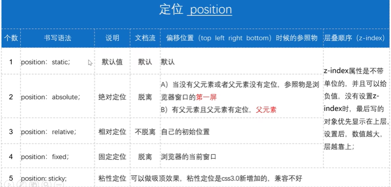

## P1

无


## P2

吹大前端


## P3

无


## P4

用于查询标签兼容性的网站：<a>caniuse.com</a>


## P5

W3C万维网联盟的四大中心居然有一个是北航（？）

W3C制定了统一的网页标准（html结构，css表现和js行为），很大程度上减少了兼容性问题，但是IE它不遵循这个


## P6

第一个网页.jpg


## P7

我用webstorm懒得换了（


## P8

`<!DOCTYPE html>`告诉浏览器按照html5的标准来解析页面

`lang="en"`是在告诉浏览器我们这是英文页面（chrome浏览器检测到本地是中文但是网页是英文会弹出翻译选项），一般我们写中文页面当然要改成`lang="zh-CN"`


## P9

web语义化的好处：

1. 没有Css的时候好看
2. 爬虫喜欢，利于seo
3. 方便自己和他人维护

网页中建议只有一个\<h1\>标签

> \<hr/\>水平线（但是以后都用css写边框来代替）
>
> \<b\>单纯加粗，\<strong\>还有语气强调（语义化）
>
> \<i\>单纯倾斜，\<em\>还有语气强调（语义化）
>
> \<s\>添加删除线，\<del\>强调删除（语义化）
>
> \<u\>下划线，\<sub\>下标，\<sup\>上标（比如论文中的注释\[1\]\[2\]..）


## P10

是练习捏


## P11

\<hr\>的属性大赏（


## P12

一些特殊符号

> `<`：`&lt;`
>
> `>`：`&gt;`
>
> `宽度受字体影响的空格`：`&nbsp`;
>
> `宽度不受字体影响的空格，宽度为一个中文`：`&emsp;`
>
> `©`：`&copy;`
>
> `™`：`&trade`;
>
> `®`：`&reg;`


## P13

div，span是没有语义的


## P14

```html
无序列表，type属性控制每一行前面的符号
<ul type="disc">
    <li></li>
    <li></li>
</ul>

有序列表，type属性控制编号方式如123,abc,ABC...，start属性是数字表示从第几号开始编号
<ol type="1" start="1">
    <li></li>
    <li></li>
</ol>

自定义列表（可以放图），通常dl里面只有一组dt和dd，因为可以给dl加样式比较方便
<dl>
    <dt>图片</dt>
    <dd>文字</dd>
</dl>
```


## P15

讲无序列表，见上面


## P16

讲自定义列表，见上面


## P17

`./`表示当前文件夹下

`../`表示上一级文件夹


## P18

图片属性中，title是鼠标悬停时的信息，alt是图片加载失败的提示信息


## P19

又是案例捏


## P20

a标签中，title属性表示鼠标悬停时的信息，target属性表示在何处打开页面，默认为`_self`，可以设置为`_blank`在新窗口打开


## P21

```html
<table>
    <tr> 行
        <td></td> 单元格
    </tr>
</table>
```


# P22

默认的时候body的高度全靠内容撑开，但是宽度模式是整个页面宽度

table的属性：

1. `border="1"`：边框宽度1px
2. `align="left"`：对齐
3. `bordercolor="red"`：边框颜色
4. `bgcolor="red"`：背景颜色
5. `cellspacing="0"`单元格之间的间距
6. `cellpadding="0"`单元格和内容之间的空隙


## P23

tr的属性：`height`，`bgcolor`，`align`文字水平对齐方式，`valign`文字垂直对齐方式


## P24

td的属性：`width`（影响同一列的高度），`height`（影响同一行的高度），`bgcolor`，`align`，`valign`


## P25

td的属性：`colspan`往后合并单元格所占的列数，`rowspan`往后合并单元格所占的行数


## P26

案例.jpg


## P27


## 下面到CSS了


## P28

无


## P29

外部样式

`<link rel="stylesheet" type="text/css" href="css路径">`

还有一种方式

```html
<html>
    <head>
        ...
        <style>
            @import url(css路径);
        </style>
    </head>
</html>
```


## P30

讲行内样式


## P31

讲样式优先级


## P32

元素选择器


## P33

如果一个元素有两个class，并且它们里面有同样的属性，那么在style里面谁在后面谁生效（不仅仅是class，只要是权重相同的选择器，都遵循这个规则）

```html
.a {
	color: red;
}
.b {
	color: blue;
}

<div class="a b">蓝色</div>
<div class="b a">还是蓝色</div>
```


## P34

讲id选择器


## P35

```css
*{
    margin: 0;
    padding: 0;
}
一般用通配符选择器只干这事
```


## P36

讲群组选择器（`div,p,.aaa{color: red}`）和后代选择器


## P37

```css
a:link 超链接的初始状态
a:visited 超链接被访问后的状态
a:hover 鼠标悬停时超链接的状态（最常用）
a:active 鼠标按下时超链接的状态
同时使用时最好按顺序写
```


## P38

伪类选择器的小案例


## P39

后代选择器的权重是权重之和


## P40

一些css属性

> `font-family`：字体，当字体名称中有空格时需要加双引号，多个字体以逗号连接，优先级递减，如果没有前面的字体则解析后面的（一般在body里面指定字体）


## P41 

无


## P42

> `font-weight`：100细，400正常，700加粗，900更粗
>
> `font-style`：italic斜体，oblique更斜体，normal正常


## P43

> `text-alugn`：left水平靠左，right，center，justify水平两端对齐（只对多行生效）
>
> `line-height`：行高，设置为盒子高度即可使单行文本垂直居中


## P44

> `letter-spacing`：字符间距
>
> `word-spacing`：单词间距
>
> `text-indent`：首行缩进


## P45

> `text-decoration`：none，underline下划线，overline上划线，line-through删除线


## P46

案例


## P47

> `text-transform`：capitalize首字母大写，lowercase全部小写，uppercase，none
>
> `font`：几个属性的集成


## P48


（符合->符号）


## P49


## P50

> `background-size`：设置长宽如100px 200px，cover使背景图片等比例放大直到盖住盒子，溢出部分被裁掉，contain使背景图片等比例放大，在不超出盒子的前提下盖住盒子，可以有留白


## P51

`background-attachment`的有趣用法

设置为fixed后，图片虽然是相对于浏览器窗口不动的，但是只会在盒子范围内显示，当往下滚动时，逐渐过渡到下面的盒子，会使得下面盒子的背景图片的上半部分出现在浏览器的下半部分，而上面盒子的上半部分正常，下半部分消失，然后逐渐一个变少一个变多直至彻底替代，不是很好形容，看下面的演示


## P52

视觉差效果，具体效果见文件夹内的`p52.html`


## P53

知乎登录界面背景案例，见`p53.html`

由于是相对于窗口固定，因此即使放大缩小页面也没有影响


## P54

复合写法


## P55

设置为浮动的盒子一行排不下会自动去第二行继续排（也未必是第二行，可以见缝插针）

文字是不会被浮动盒子挡住的，会被挤出来


## P56


举个例子

```html
<div 1>
    <div>float left</div>
    <div>float left</div>
</div>
<div 2>不浮动</div>
```

会观察到div1的高度塌陷变成0了，于是div2会顶上去

解决这个问题的方法：

1. 给div1设置固定高度
2. 给div2设置clear:left清除左浮动（**注意：是给下面的div2盒子加**）
3. 在div1里面的最后加上一个`<div style="clear: both"></div>`，自己解决自己的问题
4. 给div1设置`overflow:hidden`引发BFC，使得内部不影响外部，让浮动元素计算高度


## P57

简单的案例


## P58

盒子模型

padding实际上是裹在盒子设置的宽高外面的

```css
div {
    width:100px;
    height:100px;
    padding:10px;
}
```

这个盒子实际上是110px宽高


## P59

padding不支持负数

但是可以设置为0来清除不想要的边距


## P60

盒子模型最里面是width和height

往外一层是padding

再往外一层是border

最外面是margin


背景色会蔓延到边框

border的各个分属性都能按方向分别设置


## P61

margin允许负值并且很常用


`margin: 0 auto;`可以让盒子**水平居中**（上下边距可以 不是0，左右必须是auto）

> 注意只有左右可以设置auto，上下设置的话没有意义


## P62

两个兄弟盒子：

1. 垂直方向上：两个盒子的间距取两个盒子的对应外边距的最大值
2. 水平方向上：两个盒子的间距取两个盒子的对应外边距之和


两个父子盒子：给子盒子设置外边距时，会**作用在父盒子上**

解决方法：

1. 改成给父盒子加内边距（**副作用是会导致父盒子实际上的大小变大**，因此还得修改父盒子大小）
2. 给父盒子加上边框（可以设置为transparent透明边框）（当然也会导致父盒子变大一点，也得改）
3. 给子盒子或者父盒子加上浮动
4. 父盒子设置`overflow:hidden`构建BFC，不对外界产生影响


## P63

我们需要学会使用ps来测量，吸取颜色和切图

> alt + 滚轮：变更大小
>
> 按住空格鼠标拖动：移动图片
>
> ctrl + r：调出标尺（右键标尺可以改成以像素为单位）,标尺可以拖动出水平辅助线
>
> 选区框好后可以右键然后变换选区，放大后达到像素级的变换
>
> ctrl + d：取消选区
>
> 窗口->信息可以调出信息面板，从这里可以看到选区的大小
>
> 切图：在选区中ctrl + c复制，然后ctrl + n新建一个和选区一样大的画布，然后在新画布中ctrl + v粘贴，最后ctrl + s保存为图片即可
>
> 也可以选择裁剪工具，右键换成切片工具，切好后 文件->导出->存储为web所用格式即可
>
> 吸管可以吸取颜色，然后右键可以拷贝十六进制代码


## P64

盒子模型案例

**使用padding和border时一定要注意它会导致盒子实际上的大小变大**

"|"还有可能是用边框做的


## P65

`overflow`：

1. `visible`：默认值，溢出内容会显示在元素外面
2. `hidden`：溢出隐藏，文本裁切
3. `scroll`：溢出内容以滚动方式显示，会有滚动条（注意：**即使没有溢出，只要设置了该属性也会有滚动条**）
4. `auto`：如果有溢出会添加滚动条，没有则正常显示（**大部分用这个**）
5. `inherit`：从父元素继承

`overflow-x`设置X轴溢出，`overflow-y`同理，只会设置一个方向，但是要注意的是，**如果要设置就必须两个都设置**


## P66

```html
<div class="info">
    <div>
        ...
    </div>
    <p></p>
</div>

想修改info中div被鼠标划过时的背景色：
.info:hover div {
	bgc...
}
```

案例中一个盒子，在鼠标滑过时右下角会产生一个“√“角标，复现方法就是先切图切出这个角标的正方形，然后在hover里面设置为背景图片，再设置背景位置即可


## P67

`white-space`：

1. `normal`：默认值，空白会被忽略
2. `nowrap`：文本不换行，在一行上继续直至遇到\<br/\>
3. `pre`：保留回车空格，不换行
4. `pre-wrap`：保留空格回车，换行
5. `pre-line`：保留回车，不保留空格，换行

> \<pre\>标签：预格式化文本，会保留空格，tab，回车，一般用于放代码


实现单行文本溢出部分用"..."代替的方法：

```css
{
    width: 100px;
    white-space: nowrap;
    overflow: hidden;
    text-overflow: ellipsis;
}
```


## P68


## P69

咕

讲行内元素和行内块元素


## P70

行内元素**无法设置上下边距**，只能设置左右边距

所以如果想要设置，需要转换为块元素或者行内块元素


## P71

```html

<p></p>
```

可以观察到img和p之间会出现一个边距

解决方法是将img也转化为块元素


`display: none;`可以隐藏元素，常用于先隐藏盒子，然后在伪类选择器中设置鼠标滑过时出现


## P72

见p72.html

做二级菜单的一个方法：

```html
<ul>
    <li>一级菜单
        <ul>
        	<li>二级菜单</li>
            <li>二级菜单</li>
        </ul>
    </li>
    <li></li>
</ul>
```


## P73

开始做一个首页的案例

**做页面的首先是得有一个设计图，然后根据图来做，需要的长度自己测量，需要的图片自己切即可**

多个类都需要的属性可以拿出来变成一个公共类

input的outline属性设置为0可以使得选中框时不出现被选中的边框效果


## P74

做案例.jpg


## P75

继续


## P76

对于颜色渐变的背景，我们无法设置background-color，因此我们可以将其当作图片来处理，切一块从上到下的背景图片然后repeat就行

关于ul里面一堆li如何设置ul高度的方法：先量li高度，再计算ul高度（不是很能说清楚，建议看视频里面如何写footer部分的三行文本的）


## P77



第一屏：浏览器窗口没有向下滑动时的那块屏幕


## P78

注意相对定位是不脱离文档流的，它原来的位置不会被占用，它会覆盖到定位的地方


## P79

但是绝对定位和固定定位是脱离文档流的，类似浮动

子绝父相.jpg


## P80

绝对定位和固定定位的区别：绝对定位是相对于第一屏，而固定定位是相对于窗口


## P81

粘性定位

可以做吸顶效果，如滚到某个位置时出现一个固定在屏幕顶部的盒子

```css
某盒子 {
    position: sticky;
    top: 0px;
}
该盒子设置为在滚动到距离顶部0px时黏住
```

> 是css3新增加的定位，可能兼容不是很好，一般浏览器可以配合js做粘性效果


## P82

定位案例

图片颜色变浅的效果可能是用减少透明度的方法做的，加上背景是白色，就可以让图片看上去颜色变浅


一个盒子可以同时设置浮动和定位


有的小图标真的只是图片，只不过使用定位放到了需要的位置而已


## P83

画三角形的方法

```css
div {
    width: 0px;
    height: 0px;
    border: 10px solid rgba(0,0,0,0)（transparent也行）;
    border-top: 10px solid red;（覆盖一部分）
}
```

这样我们就得到了一个向下的红色三角形，之后通过定位放到需要的地方即可

（如导航栏的一级菜单有向下箭头，点击后出现二级菜单，同时变成向上箭头，这样的箭头就是这样弄出来的）

其它方向的三角形同理

由于div是块元素，因此我们也可以用span来做，不过需要记得设置为行内块元素


见p83.html


## P84

两个都有定位的盒子如果有相交的部分，那么后设置样式的盒子会居于上层，部分盖住先设置样式的盒子

如果想自己设置层级，修改`z-index`即可，值越大层级越高，越会在上面


## P85

子绝父相时，如果想让父盒子盖在子盒子上面，那么需要给子盒子设置负的`z-index`，注意，这里给父盒子设置较大的`z-index`是无效的


> 将行内元素变成块元素的方法：
>
> 1. `display:block`
> 2. `position:absolute`
> 3. `float:left`


## P86

1. 让盒子在屏幕中居中：

   ```css
   div {
       width: 200px;
       height: 200px;
       position: absolute;
       top: 50%;
       left: 50%;
       margin-top: -100px;
       margin-left: -100px;
   }
   ```

2. 让盒子在父盒子中居中：同理，子绝父相即可


## P87

绝对定位和浮动的区别：

浮动算是半脱离文档流，会有文字环绕的效果，但是绝对定位没有，它是全部脱离文档流，被定位到上面的盒子会无情盖住下面的文字


## P88

锚点（就像是那种能够点击跳转到文章不同位置的目录）

原理就是用a链接进行页面内的跳转

`<a href="#aaa"></a>`（别忘了#）

`<div id="aaa"></div>`


## P89

精灵图/雪碧图

`background-position`

（显然位置一般设置为负值，因为要把图片往左上方移）

（如果设置的距离有点偏差，可以在检查里面方向键微调距离）


## P90

宽高自适应

宽度自适应：不写`width`，或者`width:auto`都行

高度自适应：同理，会被内容撑开

> width: 100%
>
> 这是设置宽度，不是自适应，相当于是width:屏幕宽度px
>
> 如果最后宽度超过了屏幕宽度（比如设置了padding），那么会被撑开，出现横向滚动条


自适应一般用在导航栏和通栏布局中


举个例子，假设有个大盒子，里面要放一些小盒子商品介绍，那么如果给大盒子设置高度了，当小盒子太多时会溢出，如果不设置高度，即自适应，那么当小盒子很少时会导致大盒子也很小，不好看，解决这个问题可以使用`min-height`

`min-height`最常用，当然其它3个类似的也可以用


自适应一般会用到这些最大最小宽度高度啥的


## P91

父元素不写高度，子元素浮动的话，父元素会发生高度塌陷

如果想让父盒子实现高度自适应，那么解决高度塌陷问题即可

1. 给父盒子设置高度：显然不能做到自适应，浮动元素过多时会出问题
2. 在父盒子内的最后加上一个`<div style="clear:both"></div>`：可以做到，但不利于代码可读性，会降低性能
3. 给父盒子设置溢出隐藏`overflow:hidden`：可以做到，但有时也会出现问题，比如之前的二级菜单案例，把菜单变成BFC后，hover里面设置出现的二级菜单会使得BFC的高度变大，进而将下面的其它盒子顶下去，而我们需求的是二级菜单浮在下面的其它盒子上（如果让二级菜单脱离文档流，子绝父相，确实能解决这个问题，但是此时由于溢出隐藏，二级菜单就显示不出来了）


## P92

伪元素：

```css
div::first-letter {
    选择的是div的第一个字母
}
div::first-line {
    选第一行
}
上面这两个很少用
---------------------------------
下面这两个常用一些
div::before {
    content: "aaaaa"
}
在div内的开头放一个aaaaa字符串进去

div::after {
    在div内的最后面加东西
}
```

解决浮动时高度塌陷的父元素的自适应问题的方法：

```css
父元素:after {
    content: "";
    clear:both;
    display:block;
    //下面3条是防御性的
    width: 0;
    height: 0;
    visibility: hidden;
}
```


## P93

让盒子随着窗口大小变化而变化：使用百分比设置高度，前提如下

```css
html, body{
    height: 100%;
}
先将html和body设置为相对于窗口100%的高度
之后再设置div时，百分比的高度设置就有意义了（因为原来这两个高度都是0，导致div设置百分比高度也一直是0）
```


## P94

两栏布局，左侧宽度固定，右侧随窗口变化而变化宽度

1. 左盒子设置左浮动和宽度，右盒子设置`margin-left`
2. 都设置左浮动，左盒子设置宽度，右盒子设置宽度为`width: calc(100% - 左盒子宽度)`    （calc函数可以实现加减乘除计算，注意运算符前后需要有空格）
3. ...


## P95

三栏布局，左右固定，中间自适应

1. 左盒子设置左浮动和宽度，右盒子设置右浮动和浮动，中盒子设置左右边距（注意：**使用这个方法时，需要先写左div和右div，然后在写中div**，如果按正常顺序写，会导致左盒子正常浮动，中盒子占据第一行，然后右盒子在下一行右浮动）
2. 和上面同理使用calc()


## P96

表单的单选框

`<input type="radio" name="aaa" id="a" checked><label for="a">AAA</label>`

这就是在name为aaa的选择框中单选，同时点击选择框后面的文字AAA也能选上，同时是默认选择AAA标签


## P97

表单多选框

`<input type="checkbox" name="aaa" id="a" checked><label for="a">AAA</label>`


## P98

`<input type="file" name="aaa" id="a">`文件上传框


`<input type="image">`这个也是上传文件，不过是图片按钮

显然这些表单都需要放在`<form>`标签里面


`<input type="hidden" name="" id="" value="想传给后端的信息">`不显示，用来给后端传信息用的


`<input type="" disabled value="给你看的值">`禁用

`<input type="" readonly value="给你看的值">`只读


# P99

```css
<select>
	<option></option>
	<option></option>
	<option></option>
	<option></option>
</select>
```

下拉菜单

select标签的属性：

1. size：显示几个选项
2. multiple：支持多选

option标签的属性：

1. value：提供给后端的value值
2. selected：默认选中


# P100

`<textarea name="" id="" cols="30" rows="10" placeholder="请输入xxx">提前设置好的内容</textarea>`文本域，多行文本输入框

但是一般用css来控制其宽高，不用cols和rows

css中设置`resize: vertical/horizontal/both默认`/none，设置文本域可以在水平方向/垂直方向/都可以/都不行进行拖动改变大小


