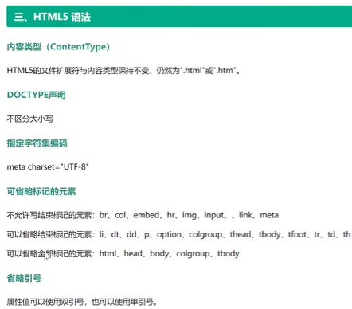
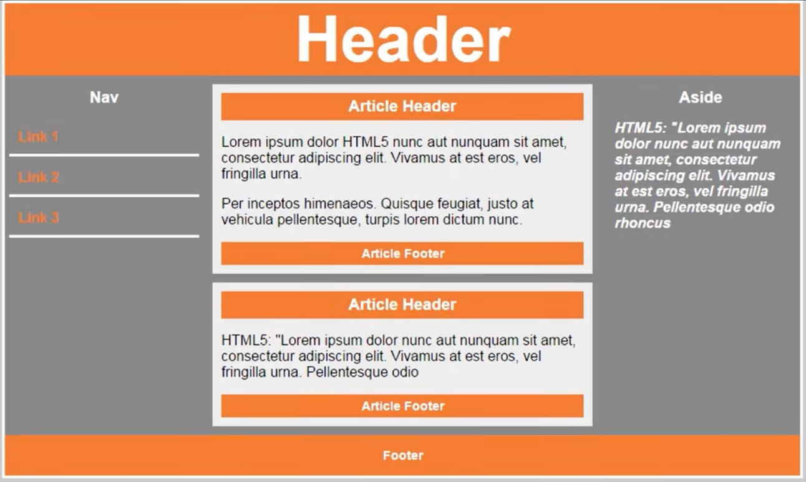

## P101

字段集

```css
<fieldset>
	<legend>性别</legend>
	<input>111
	<input>111
	<input>111
	<input>111
	<input>111
</fieldset>
```

可以自己看效果，就是加了个边框，边框左上会有个缺口，缺口里面写着“性别”

fieldset在css里面可以更改各种样式


## P102




## P103

语义化标签




```html
<header></header>
<section>
    <nav></nav>
    <main>
    	<article>
        	<header></header>
            <footer></footer>
        </article>
    </main>
    <aside></aside>
</section>
<footer></footer>
```


## P104

```html
<audio src="" controls loop autoplay muted>音频或视频</audio>
// controls：出现控制栏（注意这个不能缺否则无法显示）
// loop：自动循环
// autoplay：自动播放（有的浏览器会默认关闭写了也没用，需要用js改）
// muted：静音
```


## P105

```html
<video src="" controls loop autoplay muted poster="" width="" height=""></video>
// controls：出现控制栏（注意这个不能缺否则无法显示）
// loop：自动循环
// autoplay：自动播放（有的浏览器会默认关闭写了也没用，需要用js改）
// muted：静音
// poster：封面图片地址
```


## P106

表单增强


部分属性如`type="tel"`是手机上用的


## P107

