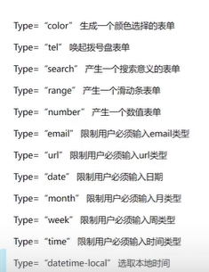
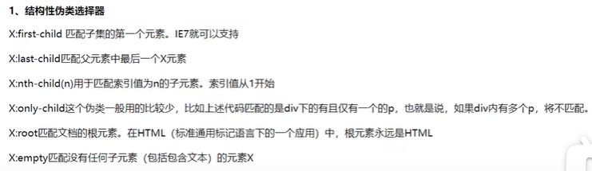

## P101

字段集

```css
<fieldset>
	<legend>性别</legend>
	<input>111
	<input>111
	<input>111
	<input>111
	<input>111
</fieldset>
```

可以自己看效果，就是加了个边框，边框左上会有个缺口，缺口里面写着“性别”

fieldset在css里面可以更改各种样式


## P102


## P103

语义化标签


```html
<header></header>
<section>
    <nav></nav>
    <main>
    	<article>
        	<header></header>
            <footer></footer>
        </article>
    </main>
    <aside></aside>
</section>
<footer></footer>
```


## P104

```html
<audio src="" controls loop autoplay muted>音频或视频</audio>
// controls：出现控制栏（注意这个不能缺否则无法显示）
// loop：自动循环
// autoplay：自动播放（有的浏览器会默认关闭写了也没用，需要用js改）
// muted：静音
```


## P105

```html
<video src="" controls loop autoplay muted poster="" width="" height=""></video>
// controls：出现控制栏（注意这个不能缺否则无法显示）
// loop：自动循环
// autoplay：自动播放（有的浏览器会默认关闭写了也没用，需要用js改）
// muted：静音
// poster：封面图片地址
```


## P106

表单增强



部分属性如`type="tel"`是手机上用的


## P107

选项列表

```html
<input type="text" list="mylist">
<datalist id="mylist">
    <option value="111"></option>
    <option value="222"></option>
    <option value="333"></option>
    <option value="444"></option>
    <option value="555"></option>
</datalist>
```

> 支持模糊搜索


## P108

一些表单里面h5新增的属性


## P109

> css3是完全兼容css2的


## P110

css3新增 层级选择器

```css
div p {
    div里面的所有p
}
div>p{
    div的儿子节点中的p
}
div+p{
    div下面的所有兄弟节点中第一个p
}
div~p{
    div下面的所有兄弟节点中所有的p
}
```


## P111

css3新增 属性选择器

```css
[class] {
    选择所有有class属性的标签
}
div[class] {
    选择有class属性的div
}
div [class] {
    选择div里面有class属性的标签
}
div[name=username] {
    选择name属性为username的div
}
-----------------------------------
注意：等号代表完全匹配，比如
div[class=box1] {
    
}
无法选中
<div class="box1 box2"></div>
------------------------------------
下面这几个并不常用

div[class~=box1] {
    选择class属性中包含box1的div
}

模糊匹配

div[class^=a] {
    选择class属性以a开头的div
}
div[class$=a] {
    选择class属性以a结尾的div
}
div[class*=a] {
    选择class属性中包含字符a的div
}
```


## P112



```html
<style>
    .box div:last-child{
        选择第三个div
    }
    .box div:nth-child(2){
        选第二个div
    }
    .box div:nth-child(2n){
        选第偶数个div，显然2n+1就是奇数个
        偶数也可以把2n换成even，2n+1换成odd
    }
</style>

<div class="box">
    <div></div>
    <div></div>
    <div></div>
</div>
```

显然，:后面修饰的是前面的X


## P113

目标伪类选择器

E:target 选择匹配E的所有元素，且匹配元素被相关URL指向

如锚点，点击时会移动到页面相应位置，此时就可以这样来选择当前被移动到的地方的标签

要是以后不明白了建议去看视频或者百度（


这个还能用来实现手风琴效果，见p113.html


## P114


E:focus匹配焦点所在的标签

E:checked是用在选择框如checkbox上的，如果想修改它的样式，有时需要注意先清除它的默认样式，如

```css
input[type=checkbox]{
    // 清除它的默认样式
    appearance: none;
    // 下面自己给它加点样式否则完全没有样式就不显示了
    width:20px;
    height:..;
    border:..;
    ...
}
input:checked{
    选择框被选中时的样式
}
```


```css
div:selection{
    background: yellow;
    color: red;
}
div中被选中的文本会适用如上样式而不是默认的蓝底白字样式
```


## P115


## P116

css3对文本新加的属性：文本阴影

`text-shadow: 10px 10px 10px red`

1. 第一个10px：水平方向位移

2. 第二个10px：垂直方向位移
3. 第三个10px：模糊程度
4. 第四个：阴影颜色

`text-shadow: 1px 1px 1px red, 1px -1px 1px yellow`

阴影可以设置多个，但必须如上设置，不能写多个`text-shadow`


## P117

盒子阴影

`box-shadow: 水平位移 垂直位移 （模糊距离 阴影大小 阴影颜色 inset） `

加上inset就是内阴影

同上，也可以同时设置多个阴影


## P118

盒子圆角

`border-radius: 10px`：四角上10px的正方形变圆

这里的10px也可以用百分比

1. 10px：四角10px圆
2. 1px 2px：左上右下1px圆，左下右上2px圆
3. 1px 2px 3px：左上，左下右上，右下
4. 1px 2px 3px 4px：左上，右上，右下，左下

只实现一个方向的圆角：可以其它方向都设置为0，也可以分开来写如

`border-top-left-radius: 10px`


## P119

`border-radius: 30px/50px`

水平方向走30px，垂直方向走50px，这两个点连一条曲线

注：这种写法只支持总的`border-radius`，不支持分开来写的

`border-radiius: 1px 2px 3px 4px/5px 6px 7px 8px`

四个角的水平方向分别是1234，垂直方向分别是5678


`border-radius: 50%`，当然自己算px也行，在正方形里面这就是个圆

```css
div{
    width:100px;
    height:50px;
    border-radius:50px 50px 0 0;
}
// 这就是半圆
```


## P120

立体搜索框案例

见p120.html
